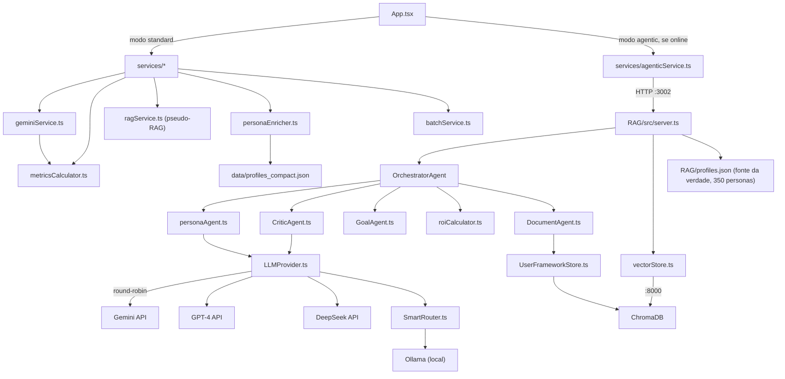

# Arquitetura — resumo

Frame-sim tem dois pipelines de simulação que compartilham o mesmo frontend
React. O modo **standard** roda inteiramente no browser: `App.tsx` monta a
config, chama `services/geminiService.ts`, que fala direto com a API do
Gemini (com rotação de 7 chaves e fallback GPT-4 → DeepSeek → mock), e
pós-processa o ROI de forma determinística via `metricsCalculator.ts`. Não há
RAG real neste modo — `ragService.ts` é um pseudo-RAG few-shot local.

O modo **agentic** delega para um backend Express (`RAG/src/server.ts`,
porta 3002). O `OrchestratorAgent` roda um loop de turnos
(Act → Critique → Replan) coordenando `personaAgent`, `CriticAgent` (checa
plausibilidade via GPT-4, fail-open se falhar) e `GoalAgent` (aumenta
dificuldade a cada 3 turnos). O RAG real usa ChromaDB (`vectorStore.ts`) com
coleções `profiles` / `metrics` / `events` / `playbooks` / `history` /
`user_frameworks`. `App.tsx` detecta disponibilidade do backend
(`checkAgenticStatus`) e cai para standard automaticamente se offline.

Em ambos os modos, a regra de ouro é: **o LLM nunca calcula o ROI final** —
ele gera narrativa e dados brutos; a matemática (curva J, dívida técnica,
CoNQ, FrameworkFit, ruído gaussiano) fica isolada em
`metricsCalculator.ts` (frontend) / `roiCalculator.ts` (backend). Ver
[modules/simulation-model.md](./modules/simulation-model.md).

Grafo de código completo em `../../graphify-out/GRAPH_REPORT.md` (684 nós,
1058 arestas; god nodes: `VectorStoreService`, `OrchestratorAgent`,
`SimulationConfig`, `ROICalculatorAgent`, `DocumentLoader`,
`PersonaProfile`). Doc de arquitetura completo (em escrita paralela):
`../../ARCHITECTURE.md`.

## Diagrama de dependências entre módulos

