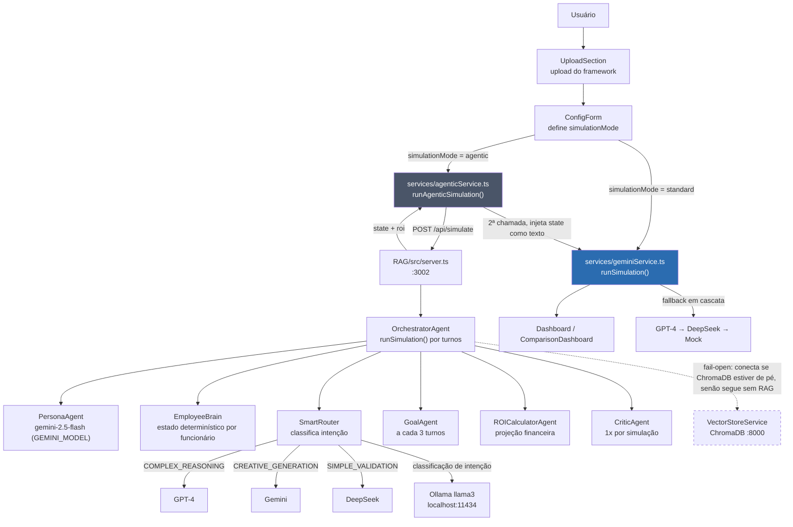
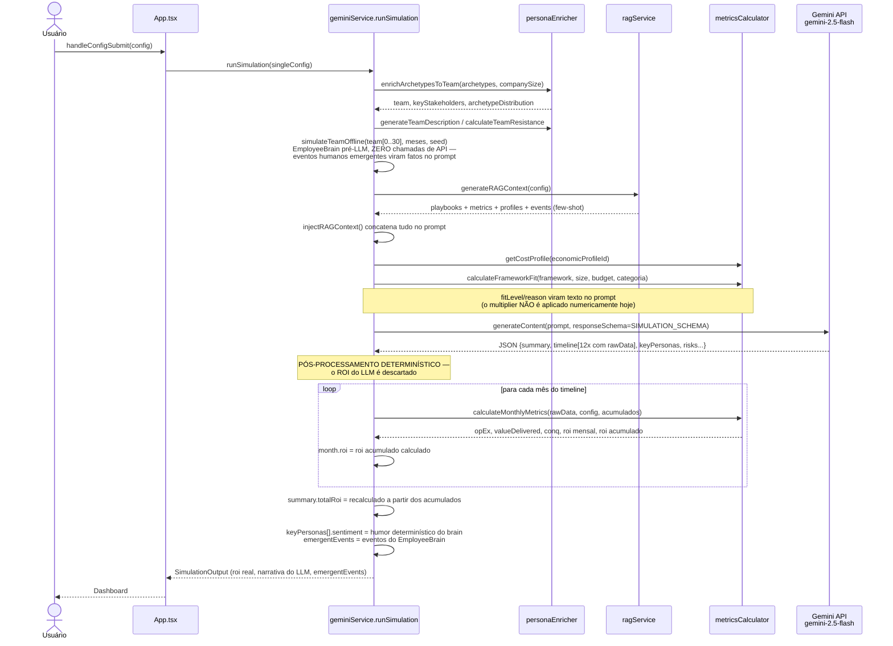
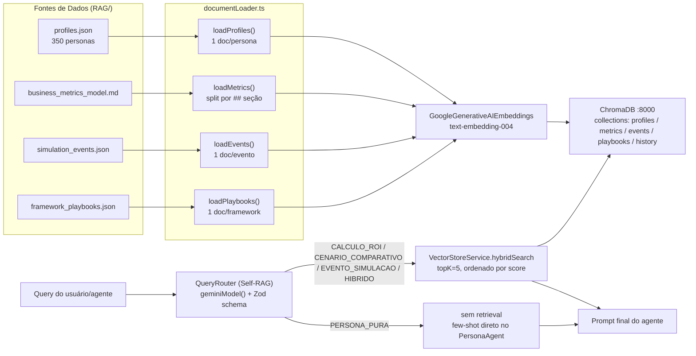
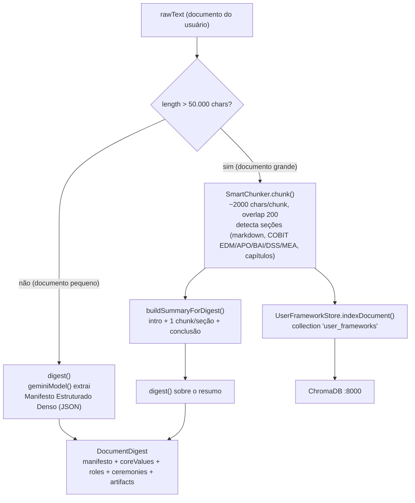
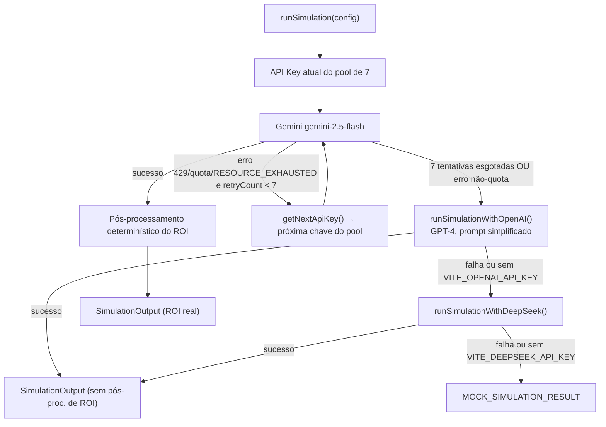
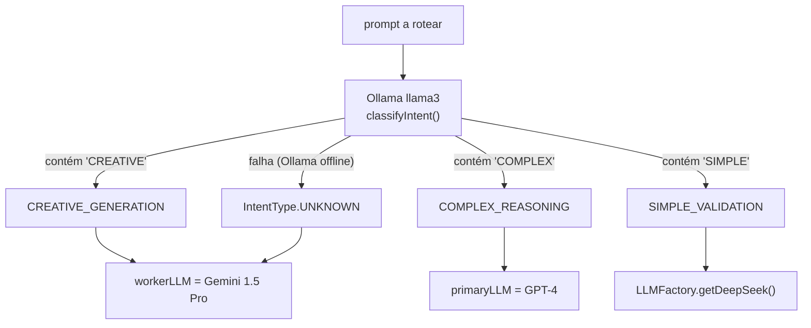

# Arquitetura — Frame-sim

> Documento técnico de arquitetura. Gerado a partir da leitura direta do código-fonte (não do README/roadmap). Onde o código diverge da intenção documentada em outros arquivos, este documento descreve **o que o código realmente faz hoje**, e marca explicitamente o que é planejado/incompleto.

## Índice

1. [Visão Geral](#1-visão-geral)
2. [Fluxo Standard (browser-only)](#2-fluxo-standard-browser-only)
3. [Fluxo Agentic (backend Node)](#3-fluxo-agentic-backend-node)
4. [Pipeline RAG](#4-pipeline-rag)
5. [Multi-LLM (providers, chaves, fallback)](#5-multi-llm-providers-chaves-fallback)
6. [Modelo Matemático Determinístico](#6-modelo-matemático-determinístico)
7. [EmployeeBrain](#7-employeebrain)
8. [Mapa de Diretórios e Arquivos-Chave](#8-mapa-de-diretórios-e-arquivos-chave)
9. [Variáveis de Ambiente](#9-variáveis-de-ambiente)
10. [Grafo do Código](#10-grafo-do-código)

---

## 1. Visão Geral

Frame-sim é um simulador de adoção de frameworks de gestão (Scrum, SAFe, COBIT, ITIL etc.) em uma empresa fictícia. O usuário sobe um documento de framework, configura o cenário (tamanho da empresa, dívida técnica, arquétipos de funcionários) e recebe uma simulação mês a mês com narrativa gerada por LLM e métricas financeiras (ROI, CoNQ, curva de adoção) calculadas deterministicamente.

Existem **dois modos de execução**, decididos no formulário de configuração (`components/ConfigForm.tsx`, campo `simulationMode: 'standard' | 'agentic'`):

- **Standard**: tudo roda no browser, uma única chamada Gemini por framework simulado.
- **Agentic**: se o backend Node (`RAG/`) estiver de pé em `localhost:3002`, a simulação passa por um loop multi-turno com agentes de persona antes de gerar o output visual (que reaproveita o pipeline standard).

> **Nota de precisão:** `services/agenticService.ts` exporta `checkAgenticStatus()` para checar `GET /api/status`, mas essa função não é chamada por nenhum componente hoje (`components/ConfigForm.tsx` apenas expõe um checkbox `simulationMode: 'agentic'` sem checar disponibilidade do backend primeiro). Se o usuário marcar "agentic" com o backend offline, `runAgenticSimulation` falha no `fetch` e o erro sobe até `App.tsx`, que volta para a tela de config com um alerta.



Ideia central do sistema: **o LLM nunca decide o número final de ROI**. Ele gera narrativa e dados operacionais brutos (`rawData`: features entregues, bugs, incidentes, learning curve); uma camada determinística (`services/metricsCalculator.ts` no frontend, `RAG/src/agents/roiCalculator.ts` no backend) recalcula o ROI a partir desses dados brutos com fórmulas fixas + ruído controlado.

---

## 2. Fluxo Standard (browser-only)

Arquivo principal: `services/geminiService.ts` (`runSimulation`), chamado por `App.tsx` a partir de `handleConfigSubmit`.



**Invariante central:** o schema `SIMULATION_SCHEMA` pede ao LLM que preencha `rawData` (features, bugs, incidentes, learning curve) por mês, mas o campo `roi` de cada mês e o `summary.totalRoi` retornado pela API são **sobrescritos** em `runSimulation` (linhas ~552-596 de `services/geminiService.ts`) pelo resultado de `calculateMonthlyMetrics`. O LLM contribui com a história (`implementationNarrative`, `roiAnalysis`, `keyPersonas`, `risks`) e com os insumos operacionais brutos; a matemática decide o número.

**Fallback de erro:** se todas as 7 chaves Gemini falharem por quota (HTTP 429 / `RESOURCE_EXHAUSTED`), `runSimulation` tenta OpenAI GPT-4 (`runSimulationWithOpenAI`), depois DeepSeek (`runSimulationWithDeepSeek`), e por fim retorna `MOCK_SIMULATION_RESULT` de `services/mockData.ts`. Note que o fallback para GPT-4/DeepSeek usa um prompt simplificado sem o pós-processamento de ROI determinístico (o JSON retornado por esses provedores é usado como está).

---

## 3. Fluxo Agentic (backend Node)

Disparado quando `simulationConfig.simulationMode === 'agentic'`. `services/agenticService.ts:runAgenticSimulation` faz **duas chamadas**: uma ao backend agentic (`RAG/`) para simular o loop multi-turno, e uma segunda ao pipeline standard (seção 2) injetando o resultado do loop como texto de contexto — ou seja, **a simulação roda duas vezes**.

```mermaid
sequenceDiagram
    participant App as App.tsx
    participant Agentic as agenticService
    participant Server as RAG/src/server.ts<br/>:3002
    participant Orch as OrchestratorAgent
    participant Persona as PersonaAgent<br/>gemini-2.5-flash (GEMINI_MODEL)
    participant Router as SmartRouter
    participant Ollama as Ollama llama3<br/>:11434
    participant LLM as LLM escolhido<br/>GPT-4 / Gemini / DeepSeek
    participant Goal as GoalAgent
    participant ROI as ROICalculatorAgent
    participant Std as geminiService.runSimulation<br/>(2ª chamada, fluxo da seção 2)

    App->>Agentic: runAgenticSimulation(config)
    Agentic->>Server: POST /api/simulate {query, stakeholders, config, teamSample}
    Server->>Server: hidrata stakeholders/teamSample: id real → RAG/profiles.json<br/>(fallback generatePersonaFromArchetype() só se o id não existir no banco de 350)
    Server->>Server: generateBackendConfig()<br/>hidrata SimulationConfig do frontend
    Server->>Orch: runSimulation([query], stakeholders, config, teamProfiles)

    Orch->>Orch: ensureBrains(stakeholders + teamProfiles)<br/>1 EmployeeBrain por persona (idempotente, deriveInitialBrain)

    loop 1 turno (runSimulation roda 1 query por padrão)
        loop por stakeholder
            Orch->>Persona: simulateResponse(persona, situacao, config, brain)
            Persona->>Persona: few-shot por arquétipo + estado interno do brain no prompt<br/>(viés cognitivo do perfil; aleatório só se o brain não tiver um)
            Persona-->>Orch: resposta_persona, emocao_detectada, impacto_moral
            Orch->>Orch: updateBrain(brain, {pressaoBase, impacto_moral, moral_time})
        end
        Orch->>Orch: updateBrain() nas personas de fundo (teamSample, sem resposta LLM no turno)
        Orch->>Orch: evaluateDecisions() por brain ativo (RNG semeado por persona+turno)<br/>+ applyContagion() quando a decisão gera contágio social

        Orch->>Router: route(prompt de consolidação do turno)
        Router->>Ollama: classifyIntent(prompt)
        alt Ollama offline ou erro
            Ollama-->>Router: (falha) → IntentType.UNKNOWN
        else Ollama responde
            Ollama-->>Router: COMPLEX_REASONING / CREATIVE_GENERATION / SIMPLE_VALIDATION
        end
        Router-->>Orch: LLMProvider (GPT-4, Gemini ou DeepSeek conforme intenção)
        Orch->>Orch: moral_time/velocidade_sprint = aggregate(brains)<br/>(determinístico — não vem mais do LLM)
        Orch->>LLM: generate(prompt de narrativa/consolidação)
        LLM-->>Orch: confianca_delta (±5), scratchpad_update, resumo_turno, eventos_disparados

        Orch->>Orch: aplica confianca_delta e clampa (moral/velocidade/confiança 0-100)

        alt turno % 3 == 0
            Orch->>Goal: evaluate(state)
            Goal-->>Orch: difficulty_scalar (0.8 crise de moral alta / 1.2 recuperação de moral baixa) + nova diretiva
            Orch->>Orch: reflect() em todos os brains (mesma cadência do GoalAgent)
        end
    end

    Orch->>Critic: critique(resumo final) — 1x por simulação, não por turno
    Critic-->>Orch: plausibility_score, replan_required (fail-open: score 100 se falhar)
    Orch->>ROI: calculateROI(config)
    ROI-->>Orch: projecao_mensal, roi_final, break_even_mes, confianca_estimativa
    Orch-->>Server: {state (com funcionarios[], eventos_rh[], plausibility_score), roi}
    Server-->>Agentic: {success, state, roi}

    Agentic->>Std: runSimulation(singleConfig com scenarioContext = resumo do state agentic)
    Note over Agentic,Std: Reaproveita 100% do fluxo standard (seção 2)<br/>para gerar o output visual rico
    Std-->>Agentic: SimulationOutput
    Agentic-->>App: SimulationOutput + agenticMetrics (quality_per_cycle, tokens, custo)
```

**Limitações confirmadas no código atual (não no README/roadmap):**

- `server.ts` carrega `RAG/profiles.json` (350 personas reais) num `Map` na subida e resolve `stakeholders`/`teamSample` por `id` nesse mapa; `generatePersonaFromArchetype()` só é usado como **fallback sintético** quando o `id` recebido não bate com nenhuma persona real. `server.ts` também tenta conectar o `VectorStoreService` (`initVectorStore()`, fail-open com timeout de 3s) e passa a instância para `createOrchestrator().setVectorStore()`. Ainda assim, `OrchestratorAgent.processQuery()` (que faria `hybridSearch` no ChromaDB) **não** é chamado pelo endpoint `/api/simulate` — quem é chamado é `runSimulation()` → `runTurn()` direto; o efeito prático do vector store conectado nesse caminho é `consolidateTurn()` conseguir salvar memória de turno (`saveMemory`) e o `ROICalculatorAgent` conseguir puxar métricas extras (`findMetrics`) — a busca híbrida por persona/playbook continua só no CLI (`RAG/src/main.ts --query`).
- `CriticAgent` agora é instanciado e chamado dentro de `OrchestratorAgent.runSimulation()` — **1 vez por simulação** (não por turno), depois do último turno e antes do `ROICalculatorAgent`. O resultado (`plausibilityScore`, `replanRequired`) é gravado em `state.plausibility_score`/`state.replan_triggered` e propagado ao frontend como `agenticMetrics.quality_per_cycle` (antes hardcoded em 100). `CriticAgent` continua sendo usado também por `AgentRacingService` e `SelfImprovementService`.
- `GoalAgent.evaluate` roda a cada 3 turnos, mas como `/api/simulate` só executa 1 query por request (`orchestrator.runSimulation([query], ...)`), na prática o `GoalAgent` quase nunca dispara pelo caminho HTTP atual — ele é pensado para simulações de múltiplos turnos como as do CLI (`main.ts --simulate`, que roda 3 queries fixas).

---

## 4. Pipeline RAG



### Ingestão de documentos do usuário

Endpoint `POST /api/ingest` (`RAG/src/server.ts`) → `DocumentAgent` (`RAG/src/agents/DocumentAgent.ts`):



`DocumentAgent.digestMultiple()` roda `process()` em paralelo para vários documentos e faz merge dos digests (união de `coreValues`, `roles`, `ceremonies` etc., deduplicados via `Set`).

---

## 5. Multi-LLM

### Providers, modelos, chaves e uso

| Camada | Provider | Modelo | Chave(s) de env | Uso |
|---|---|---|---|---|
| Frontend (`services/geminiService.ts`) | Google Gemini | `gemini-2.5-flash` | `VITE_API_KEY` .. `VITE_API_KEY_7` (round-robin, 7 chaves) | Simulação principal (schema JSON estrito) |
| Frontend (`digestFrameworkDocument`) | Google Gemini | `gemini-2.5-flash` | `VITE_API_KEY` | Digestão rápida de documento (fetch direto à API REST) — antes `gemini-1.5-flash`, aposentado pela API (404) |
| Frontend fallback | OpenAI | `gpt-4-turbo-preview` | `VITE_OPENAI_API_KEY` | Fallback se as 7 chaves Gemini estourarem quota |
| Frontend fallback | DeepSeek | `deepseek-chat` | `VITE_DEEPSEEK_API_KEY` | Fallback final antes do mock |
| Frontend fallback final | — | — | — | `services/mockData.ts` (`MOCK_SIMULATION_RESULT`) |
| Backend RAG (`LLMProvider.ts:geminiModel()`) | Google Gemini | `gemini-2.5-flash` (default), configurável via `GEMINI_MODEL` | `GOOGLE_API_KEY`, `GOOGLE_API_KEY_2`, `GOOGLE_API_KEY_3` (round-robin, 3 clientes) | Worker LLM do `SmartRouter`, `PersonaAgent`, `ROICalculatorAgent`, `queryRouter.ts` (via `@langchain/google-genai`) — antes hardcoded em `gemini-1.5-pro`/`gemini-1.5-flash`, aposentados pela API (404) |
| Backend RAG | OpenAI | `gpt-4` | `OPENAI_API_KEY` | Primary LLM do `SmartRouter`, `CriticAgent` |
| Backend RAG | DeepSeek | `deepseek-chat` | `DEEPSEEK_API_KEY` | Rota `SIMPLE_VALIDATION` do `SmartRouter` |
| Backend RAG | Ollama (local) | `llama3` (configurável) | `OLLAMA_BASE_URL` (default `http://localhost:11434`) | "Cérebro" do `SmartRouter` — classifica intenção antes de rotear, gratuito |
| Query classification (`queryRouter.ts`) | Google Gemini | `geminiModel()` (default `gemini-2.5-flash`) | `GOOGLE_API_KEY` | Self-RAG: decide modo (`PERSONA_PURA`/`CALCULO_ROI`/...) |
| Embeddings (`vectorStore.ts`, `UserFrameworkStore.ts`) | Google | `text-embedding-004` | `GOOGLE_API_KEY` | Embeddings para ChromaDB |

### Cascata de fallback do frontend



### SmartRouter (backend agentic)



---

## 6. Modelo Matemático Determinístico

Duas implementações independentes coexistem (não compartilham código):

- **Frontend**: `services/metricsCalculator.ts` (`calculateMonthlyMetrics`) — usada em `runSimulation` para sobrescrever o ROI do LLM, mês a mês, com acumuladores passados entre chamadas.
- **Backend RAG**: `RAG/src/agents/roiCalculator.ts` (`ROICalculatorAgent.calculateMonthlyProjection`) — projeção standalone usada por `orchestrator.runSimulation()` no modo agentic, com suas próprias constantes (`BASE_VARIABLES.PME/Enterprise`) e sua própria curva J. Há também uma terceira função, `services/ragService.ts:calculateDeterministicROI`, definida no frontend mas **não referenciada em nenhum outro lugar do código** (função morta hoje).

### Fórmulas (frontend, `metricsCalculator.ts`)

| Métrica | Fórmula | Notas |
|---|---|---|
| **OpEx mensal** | `teamSize * DEV_DAY_COST * 22` | Constantes vêm de `getCostConstants(economicProfileId)`, lidas de `data/cost_profiles.json`; fallback `DEFAULT_CONSTANTS` (`DEV_DAY_COST=400`, `FEATURE_VALUE=3000`, `INCIDENT_COST=5000`, `BUG_FIX_COST=300`) |
| **Penalidade de dívida técnica** | `high → ×0.85`, `critical → ×0.65`, senão `×1.0` | Aplicada apenas ao `featureValue` |
| **Fator de escala do time** | `log10(max(10, teamSize)) / 2` | Log para achatar o ganho de valor em times muito grandes |
| **Valor de features** | `featuresDelivered * FEATURE_VALUE * teamScaleFactor * learningCurveFactor * techDebtPenalty` | `learningCurveFactor` vem do `rawData` gerado pelo LLM (0.5–1.3 tipicamente) |
| **Taxa base de manutenção** | `0.65` base; `+0.10` se dívida `low`; `-0.10` se `critical`; `-0.05` se `previousFailures` | Clampada entre `0.55` e `0.75` |
| **Valor de manutenção** | `opEx * maintenanceBaseRate * efficiencyMultiplier * complianceMultiplier` | `efficiencyMultiplier = max(0.4, efficiency/100)`; `complianceMultiplier = compliance/100` |
| **Valor entregue (base)** | `featureValue + maintenanceValue` | Antes do Surprise Factor |
| **CoNQ (Custo da Não-Qualidade)** | `bugsGenerated * BUG_FIX_COST + criticalIncidents * INCIDENT_COST` | |
| **ROI mensal** | `((valueDelivered - conq) - opEx) / opEx * 100` | |
| **ROI acumulado** | `((Σvalue - Σconq) - ΣopEx) / ΣopEx * 100` | Acumuladores passados entre chamadas mensais em `runSimulation` |

### Surprise Factor (`calculateSurpriseFactor`)

Não é ruído gaussiano — é um **gatilho probabilístico com multiplicador uniforme**:

- Probabilidade base: `5%`. Soma `+5%` se `learningCurveFactor ≥ 1.1`, `+3%` se `bugsGenerated < featuresDelivered*0.3`, `+4%` se `efficiency ≥ 85`, `+3%` se `teamSize ≤ 50`. Máximo teórico ≈ `20%` (o texto do prompt em `ragService.ts` chama isso de "~15%" como caso típico).
- Se disparado (`Math.random() < probabilidade`), aplica um multiplicador em `valueDelivered` de `1.15` a `1.40` (+ até `0.08` extra se havia dívida técnica alta/crítica superada), capado em `1.50`.
- Efeito: permite que cenários difíceis produzam, ocasionalmente, resultados financeiros surpreendentemente bons — evita que o modelo seja 100% previsível a partir dos parâmetros de entrada.

### Framework-Organization Fit (`calculateFrameworkFit`)

Classifica o framework citado (por substring do nome, ex. `scrum`, `safe`, `cobit`) em `lightweight` / `medium` / `enterprise`, cruza com o porte da empresa (`≤50` / `51-200` / `>200`) e orçamento, e produz um `fitLevel` (`EXCELENTE`/`BOM`/`NEUTRO`/`RUIM`/`PÉSSIMO`) com multiplicador teórico de `0.60` a `1.35`.

> **Precisão importante:** esse `multiplier` é calculado mas **não é aplicado numericamente** em `calculateMonthlyMetrics`. Em `geminiService.ts`, apenas `frameworkFit.reason` e `frameworkFit.fitLevel` são injetados como texto no prompt (`fitContext`), instruindo o LLM a gerar `rawData` consistente com o fit (mais features/menos bugs se excelente, o oposto se péssimo). O efeito é indireto — depende do LLM seguir a instrução — e não uma multiplicação garantida.

### Backend RAG (`roiCalculator.ts`) — Curva J e ruído

- **Curva J**: `J_CURVE_FACTORS = [0.6, 0.6, 0.9, 0.9, 1.2, 1.2, 1.3, 1.3, 1.4, 1.4, 1.5, 1.5]` (indexado por mês, satura no último valor após o mês 12).
- **Modificadores de dívida técnica**: tabela `TECH_DEBT_MODIFIERS` com `bugs` (multiplicador de bugs), `velocity` (multiplicador de features) e `taxa` (juros compostos mensais da dívida) — de `BAIXA (0.8x bugs, 1.0x velocidade, 1% a.m.)` até `CRÍTICA (2.0x bugs, 0.5x velocidade, 15% a.m.)`.
- **Ruído estocástico**: `noise = Math.random()*0.2 - 0.1` (uniforme, ±10%), aplicado como `opex *(1+noise*0.5)`, `value*(1+noise)`, `conq*(1+|noise|*2)` — CoNQ tende a piorar com o caos, OpEx é o mais estável dos três.
- **Eventos**: `applyEvents()` sorteia eventos de `SimulationEvent[]` por mês (`probabilidade_base / 12`), aplicando impacto direto em `value`/`opex` quando disparam.
- **Confiança da estimativa** (`determineConfidence`): score começa em 3, cai com duração > 24/36 meses, dívida alta/crítica e histórico traumático; mapeia para `Alta`/`Média`/`Baixa`.

O frontend (`ragService.ts`) usa o **mesmo conceito** de Curva J (`J_CURVE_FACTORS = [0.75, 0.8, 0.9, 0.95, 1.1, 1.15, 1.2, 1.25, 1.3, 1.3, 1.35, 1.35]`) e de modificadores de dívida técnica, mas apenas como **texto de orientação injetado no prompt** do Gemini (`generateRAGContext` → seção `metrics`) — não como cálculo executado; quem de fato calcula os números finais no frontend é `metricsCalculator.ts`, guiado pelo `rawData` que o LLM devolve seguindo essas orientações.

---

## 7. EmployeeBrain

Módulo puro e implementado em `RAG/src/core/employeeBrainCore.ts` (zero imports, nem node builtins — importável tanto pelo backend RAG quanto pelo frontend Vite), com 6 testes em `RAG/src/tests/brain.test.ts` (`npx tsx src/tests/brain.test.ts` dentro de `RAG/`). Antes desta implementação, o estado emocional dos funcionários era inteiramente decidido pelo LLM a cada chamada (`keyPersonas[].sentiment`, `emocao_detectada` do `PersonaAgent`), sem estado persistente entre turnos. O EmployeeBrain inverte isso: estado determinístico por funcionário, com o LLM apenas dando "voz" ao estado já calculado.

### Ideia de design

Estado interno por funcionário simulado (`EmployeeBrainState`):

- `estresse` (0-100), `humor` (-100..100), `energia` (0-100), `engajamento` (0-100)
- `status`: `ativo | licenca | burnout | pediu_demissao` (ver nota abaixo — `'burnout'` é um valor de tipo que hoje nunca é atribuído em runtime)
- `memoria`: buffer FIFO dos últimos 12 eventos (`{turno, evento, valencia}`)
- `reflexao`: gerada a cada 3 turnos (`reflect()`), a partir das 3 memórias de maior `|valência|`
- Traços derivados do perfil real (`resiliencia`, `adaptabilidade`, `influencia`, `workaholic`, humor/engajamento iniciais) via `deriveTraits()`, calculados deterministicamente a partir de campos de texto de `PersonaProfile` (`gestao_estresse`, `abordagem_trabalho`, `opiniao_agil`, `cargo`/`senioridade`, `estilo_comunicacao`) + um jitter ±8 semeado por `id` para variar entre personas com o mesmo texto de perfil.

Atualização **determinística por turno** (`updateBrain()`), com RNG semeado (`mulberry32` + `hashString`) — dada a mesma seed e a mesma sequência de eventos, o estado final é reproduzível (diferente do `Math.random()` não semeado em `metricsCalculator`/`roiCalculator`). Decisões (`evaluateDecisions()`) usam um RNG derivado de `hashString(personaId:turno)`.

`aggregate()` deriva as métricas que antes o LLM inventava livremente:
- `moral` = média de `(humor+100)/2` sobre os brains não-desistentes.
- `velocidadeMod` (0-1) = `1 - 0.5*(fração afastados+desistentes) - 0.3*(1 - engajamento médio dos ativos)`.
- `sentimentPorPersona[id]` = `(humor+100)/2` de cada funcionário — é isso que sobrescreve `keyPersonas[].sentiment` no modo standard e alimenta o state agentic.

O `PersonaAgent` continua chamando o LLM, mas o prompt agora inclui uma seção "ESTADO INTERNO ATUAL" (estresse, humor, energia, engajamento, memórias recentes, reflexão) — o LLM só transforma esse estado em uma frase em primeira pessoa (`resposta_persona`); os números nunca são revelados na resposta. O viés cognitivo também deixou de ser sorteado: `personaAgent.buildPrompt` usa `brain.viesCognitivo` (derivado do perfil) e só sorteia aleatoriamente quando o brain não tem um. **Nenhuma chamada extra de LLM é necessária** — o cálculo de estado é local/determinístico.

### Ciclo de vida do funcionário (implementado)

```mermaid
stateDiagram-v2
    [*] --> ativo

    ativo --> pediu_demissao: turnosEstresseAlto>=2 & humor<-40<br/>(sorteio 35%, RNG semeado por persona+turno) — terminal
    ativo --> licenca: estresse>90 ou energia<15<br/>(decisão tipo "burnout"; turnosAfastado=2)
    licenca --> licenca: turnosAfastado--<br/>humor recupera +10/turno rumo ao neutro
    licenca --> ativo: turnosAfastado chega a 0<br/>estresse=45, energia=60, humor+40, turnosEstresseAlto=0

    ativo --> ativo: resistencia_passiva (humor<-30 & adaptabilidade<45)<br/>confronto_lideranca (humor<-50 & influencia>70, avaliado ANTES de fofoca)<br/>fofoca (humor<-40 & influencia>60, contágio social)<br/>— no máx. 1 decisão "grave" destas por turno, ordem fixa
    ativo --> ativo: apoiar_mudanca / pedir_ajuda<br/>(não-graves, independentes, podem coexistir com 1 decisão grave)
```



> **Nota de precisão:** `EmployeeStatus` inclui `'burnout'` como valor válido, e `updateBrain()`/`aggregate()` tratam esse status como terminal/afastado — mas nenhum caminho do código hoje atribui `status: 'burnout'`. A decisão de tipo `"burnout"` (estresse>90 ou energia<15) leva o funcionário direto a `status: 'licenca'` com `turnosAfastado=2`. Na prática só existem 3 estados alcançáveis em runtime: `ativo`, `licenca`, `pediu_demissao`.

### Catálogo de decisões humanas (implementado, `evaluateDecisions()`)

Avaliadas em ordem fixa; a primeira cujo gatilho **e** sorteio dispararem "ganha" — no máximo 1 decisão grave por turno. `apoiar_mudanca` e `pedir_ajuda` são independentes e podem coexistir com 1 grave.

| Decisão | Gatilho real | Efeito |
|---|---|---|
| `pedido_demissao` (grave) | `turnosEstresseAlto>=2 && humor<-40`, sorteio 35% | `status → pediu_demissao` (terminal); `moralGlobal -8` |
| `burnout` (grave) | `estresse>90 \|\| energia<15` | `status → licenca`, `turnosAfastado=2` (recupera humor +40 e zera `turnosEstresseAlto` no retorno) |
| `resistencia_passiva` (grave) | `humor<-30 && adaptabilidade<45` | `engajamento -10` |
| `confronto_lideranca` (grave, avaliado antes de fofoca — seu gatilho é subconjunto estrito do dela) | `humor<-50 && influencia>70` | `confianca -5` |
| `fofoca` / contágio social (grave) | `humor<-40 && influencia>60` | `applyContagion`: 3 alvos ativos sorteados (nunca o próprio), `humor -3`, `estresse +4` |
| `apoiar_mudanca` (não-grave) | `humor>40 && engajamento>65` | `moralGlobal +3`; contágio positivo: 2 alvos, `humor +2` |
| `pedir_ajuda` (não-grave) | `estresse` entre 60 e 80 `&& humor>0` | `estresse -10` — janela de intervenção antes de escalar |

### Modo standard (offline, zero LLM): `simulateTeamOffline()`

Usado por `services/geminiService.ts:runSimulation` antes da chamada ao Gemini: roda o time inteiro (`team.slice(0, 30)`) por `durationMonths` meses com `impactoPessoal=0` e pressão default por mês (`1-2 → 0.7, 3-4 → 0.5, 5+ → 0.35`), reflexão a cada 3 meses. Os eventos emergentes (`emergentEvents`) entram no prompt do LLM como fatos já ocorridos, e `keyPersonas[].sentiment` é sobrescrito pelo humor determinístico do brain correspondente (match por nome). `SimulationOutput.emergentEvents?` carrega esses eventos para a UI.

### Integração no modo agentic (`OrchestratorAgent`)

`ensureBrains()` cria 1 `EmployeeBrainState` por stakeholder + `teamProfiles` (idempotente por `id`), guardado em `this.brains` e espelhado em `state.funcionarios`. A cada turno: `updateBrain()` roda para stakeholders (com `impacto_moral` da resposta do `PersonaAgent`) e para o time de fundo (com o delta de moral do turno anterior amortecido); `evaluateDecisions()` roda para todo brain ativo e acumula `state.eventos_rh` (todas as narrativas) e `state.eventos_disparados` (só as graves: `pedido_demissao`, `burnout`, `confronto_lideranca`). `consolidateTurn()` computa `moral_time`/`velocidade_sprint` via `aggregate(brains)` **antes** de chamar o LLM — o LLM só ajusta `confianca_delta` (clampado ±5) e narra (`scratchpad_update`, `resumo_turno`, `eventos_disparados`); se a chamada ao LLM falhar, o estado numérico já foi commitado e nada precisa reverter.

### Por que este design (determinístico + LLM só narra)

O mesmo princípio da seção 6 se aplica aqui: **números vêm de fórmulas, não de geração de texto livre**. Isso resolve dois problemas do estado anterior — (1) inconsistência entre turnos (o LLM "esquecia" o estado emocional de um funcionário de uma chamada para outra, porque cada chamada era stateless) e (2) custo — cada turno já fazia 1 chamada de LLM por stakeholder (`PersonaAgent.simulateResponse`); o EmployeeBrain não adiciona chamadas, apenas enriquece o prompt existente com estado real.

---

## 8. Mapa de Diretórios e Arquivos-Chave

```
Frame-sim/
├── App.tsx                        # Máquina de estados: upload → config → simulating → results/batch
├── index.tsx, index.html          # Entry point Vite
├── types.ts                       # SimulationConfig, SimulationOutput, tipos de Batch/Racing/Warmup
├── vite.config.ts
│
├── components/                    # UI React (upload, config, dashboards, gráficos)
│   ├── UploadSection.tsx
│   ├── ConfigForm.tsx              # Define simulationMode: 'standard' | 'agentic'
│   ├── SimulationLoader.tsx
│   ├── Dashboard.tsx / ComparisonDashboard.tsx
│   ├── BatchSimulationPanel.tsx / BatchResultsChart.tsx
│   ├── CostBreakdownPanel.tsx
│   └── ui/
│
├── services/                      # Lógica de negócio do frontend (browser-only)
│   ├── geminiService.ts            # runSimulation() — engine principal + pós-proc. de ROI
│   ├── ragService.ts                # Few-shot RAG, Curva J (texto de prompt), calculateDeterministicROI (não usado)
│   ├── personaEnricher.ts           # Arquétipo → personas reais de data/profiles_compact.json
│   ├── metricsCalculator.ts         # calculateMonthlyMetrics, Surprise Factor, Framework Fit
│   ├── agenticService.ts            # Ponte para o backend RAG (checkAgenticStatus, runAgenticSimulation)
│   ├── batchService.ts              # Reimplementação frontend de Monte Carlo + Warmup + Racing
│   ├── SmartChunker.ts              # Cópia frontend do chunker (usado na digestão local de docs)
│   └── mockData.ts                  # MOCK_SIMULATION_RESULT (fallback final)
│
├── data/
│   ├── profiles_compact.json        # Personas compactas usadas por personaEnricher
│   └── cost_profiles.json           # Perfis econômicos (PME BR, Startup, US FAANG etc.)
│
├── RAG/                            # Backend Node/Express independente (porta 3002)
│   ├── src/server.ts                # Express app: /api/status, /api/simulate, /api/ingest
│   ├── src/main.ts                  # CLI: --index, --query, --simulate, --test
│   ├── src/core/
│   │   └── employeeBrainCore.ts      # EmployeeBrain — estado determinístico por funcionário (puro, zero imports)
│   ├── src/tests/
│   │   └── brain.test.ts             # 6 testes do employeeBrainCore (npx tsx src/tests/brain.test.ts)
│   ├── src/agents/
│   │   ├── orchestrator.ts           # OrchestratorAgent — loop de turnos + EmployeeBrain + CriticAgent 1x/simulação
│   │   ├── personaAgent.ts           # Simula resposta de stakeholder (geminiModel(), default gemini-2.5-flash)
│   │   ├── GoalAgent.ts              # Ajusta dificuldade a cada 3 turnos
│   │   ├── CriticAgent.ts            # Plausibilidade 0-100 — 1x por simulação em runSimulation(), também usado por Racing/SelfImprovement
│   │   ├── roiCalculator.ts          # ROICalculatorAgent — projeção financeira determinística
│   │   └── DocumentAgent.ts          # Digestão + chunking de documentos do usuário
│   ├── src/services/
│   │   ├── LLMProvider.ts            # GeminiProvider, OpenAICompatibleProvider, OllamaProvider, LLMFactory
│   │   ├── SmartRouter.ts            # Roteia por intenção (Ollama classifica)
│   │   ├── queryRouter.ts            # Self-RAG: classifica modo da query (Zod schema)
│   │   ├── vectorStore.ts            # VectorStoreService — ChromaDB, hybridSearch
│   │   ├── documentLoader.ts         # Carrega profiles/metrics/events/playbooks para indexação
│   │   ├── SmartChunker.ts           # Chunking semântico (~2000 chars, overlap 200)
│   │   ├── UserFrameworkStore.ts     # Collection 'user_frameworks' para docs do usuário
│   │   ├── AgentRacingService.ts     # N agentes em paralelo, Critic escolhe vencedor
│   │   └── SelfImprovementService.ts # Warmup iterativo de parâmetros (temperatura, topK, ragMode)
│   ├── src/types/index.ts
│   ├── profiles.json                 # 350 personas reais (fonte de verdade do RAG)
│   ├── framework_playbooks.json
│   ├── simulation_events.json
│   ├── business_metrics_model.md
│   └── generate_profiles.py
│
├── legacy_v1/                      # Código antigo — ignorar
├── next_steps/                     # Specs antigas de arquitetura agêntica
├── architecture_images/            # Imagens de arquitetura geradas (PNG)
├── graphify-out/                   # Grafo do código (ver seção 10)
└── .context/                       # Docs internas (fora do escopo deste arquivo)
```

### Arquivos-chave (referência rápida)

| Responsabilidade | Caminho |
|---|---|
| Engine de simulação standard | `services/geminiService.ts` |
| Recalculo determinístico de ROI (frontend) | `services/metricsCalculator.ts` |
| RAG few-shot + Curva J (frontend) | `services/ragService.ts` |
| Personas reais → time simulado | `services/personaEnricher.ts` |
| Ponte para backend agentic | `services/agenticService.ts` |
| Servidor Express do backend agentic | `RAG/src/server.ts` |
| Loop de turnos multi-stakeholder | `RAG/src/agents/orchestrator.ts` |
| Simulação de stakeholder individual | `RAG/src/agents/personaAgent.ts` |
| EmployeeBrain (estado determinístico por funcionário) | `RAG/src/core/employeeBrainCore.ts` |
| ROI determinístico (backend) | `RAG/src/agents/roiCalculator.ts` |
| Roteamento multi-LLM por intenção | `RAG/src/services/SmartRouter.ts` |
| Factory de providers LLM | `RAG/src/services/LLMProvider.ts` |
| Self-RAG (classifica se usa retrieval) | `RAG/src/services/queryRouter.ts` |
| Vector store / ChromaDB | `RAG/src/services/vectorStore.ts` |
| Ingestão de documentos do usuário | `RAG/src/agents/DocumentAgent.ts` |

---

## 9. Variáveis de Ambiente

| Variável | Onde é lida | Usada por | Status |
|---|---|---|---|
| `VITE_API_KEY` .. `VITE_API_KEY_7` | `.env` (raiz) | `services/geminiService.ts` — pool de 7 chaves Gemini com rotação em `getApiKeys()`/`getNextApiKey()` | Ativa |
| `VITE_OPENAI_API_KEY` | `.env` (raiz) | `runSimulationWithOpenAI` (fallback GPT-4) | Ativa |
| `VITE_DEEPSEEK_API_KEY` | `.env` (raiz) | `runSimulationWithDeepSeek` (fallback final) | Ativa |
| `GOOGLE_API_KEY`, `GOOGLE_API_KEY_2`, `GOOGLE_API_KEY_3` | `.env` (raiz) e `RAG/.env` | `RAG/src/services/LLMProvider.ts:GeminiProvider` (round-robin), `queryRouter.ts`, `vectorStore.ts`, `UserFrameworkStore.ts`, `personaAgent.ts`, `roiCalculator.ts` | Ativa |
| `OPENAI_API_KEY` | `RAG/.env` | `RAG/src/services/LLMProvider.ts:LLMFactory.getGPT4()` (usado por `SmartRouter` e `CriticAgent`) | Ativa |
| `DEEPSEEK_API_KEY` | `RAG/.env` | `RAG/src/services/LLMProvider.ts:LLMFactory.getDeepSeek()` (rota `SIMPLE_VALIDATION` do `SmartRouter`) | Ativa |
| `OLLAMA_BASE_URL` | `RAG/.env` | `RAG/src/services/LLMProvider.ts:OllamaProvider` (default `http://localhost:11434`) | Ativa |
| `CHROMA_URL` | `RAG/.env` | `RAG/src/services/UserFrameworkStore.ts` (default `http://localhost:8000`) | Ativa, **porém** `RAG/src/services/vectorStore.ts` hardcoda `http://localhost:8000` e não lê essa variável — inconsistência a corrigir se o Chroma mudar de endereço |
| `GEMINI_MODEL` | `RAG/.env` | `RAG/src/services/LLMProvider.ts:geminiModel()` (default `gemini-2.5-flash`), consumida por `GeminiProvider`, `personaAgent.ts`, `queryRouter.ts` | Ativa (opcional) — lida de forma lazy (dentro da função, não no import) para que o `dotenv` já tenha carregado o `.env` |
| `CHROMA_DB_PATH` | `RAG/.env.example` | `RAG/src/services/vectorStore.ts` constructor (`dbPath`), mas o valor não é de fato usado nas chamadas `Chroma.fromExistingCollection`/`Chroma.fromDocuments` (que usam a `url` fixa acima) | Documentada no `.env.example`, efeito limitado no código atual |

---

## 10. Grafo do Código

O repositório tem um grafo de código gerado (`graphify`) em `graphify-out/`:

- `graphify-out/GRAPH_REPORT.md` — relatório com comunidades, god nodes e conexões surpreendentes.
- `graphify-out/graph.html` — visualização interativa do grafo.
- `graphify-out/graph.json` — dados brutos do grafo.

Snapshot do relatório (684 nós, 1058 arestas, 33 comunidades, construído do commit `aabb8733`):

**God nodes (mais conectados — os hubs reais da arquitetura):**

1. `VectorStoreService` — 24 arestas
2. `OrchestratorAgent` — 18 arestas
3. `SimulationConfig` — 18 arestas
4. `ROICalculatorAgent` — 15 arestas
5. `DocumentLoader` — 13 arestas
6. `PersonaProfile` — 13 arestas

Esses hubs confirmam, pelo grafo, o que a leitura de código também mostra: `VectorStoreService` e `OrchestratorAgent` são os pontos de maior acoplamento do backend RAG (por isso as limitações descritas na seção 3 — RAG não conectado, CriticAgent não usado no loop principal — importam tanto: mexer neles tem alto raio de impacto). `SimulationConfig` é o tipo mais compartilhado entre frontend e backend, o que explica a necessidade de "hidratação" manual entre os dois formatos em `server.ts` (`generateBackendConfig`, `generatePersonaFromArchetype`).

> O grafo pode ficar desatualizado conforme o código muda. Para atualizar: `graphify update .` (sem custo de API). Compare `git rev-parse HEAD` com o commit citado no relatório para saber se está defasado.
