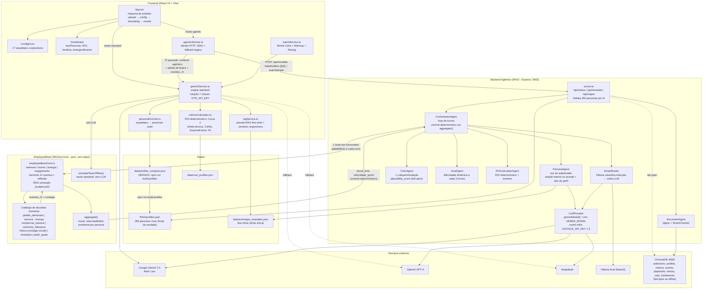
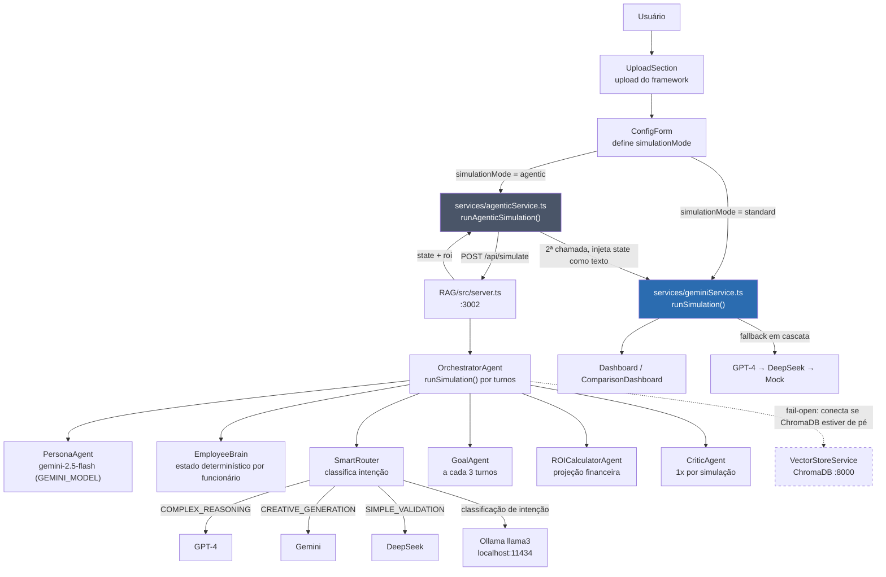
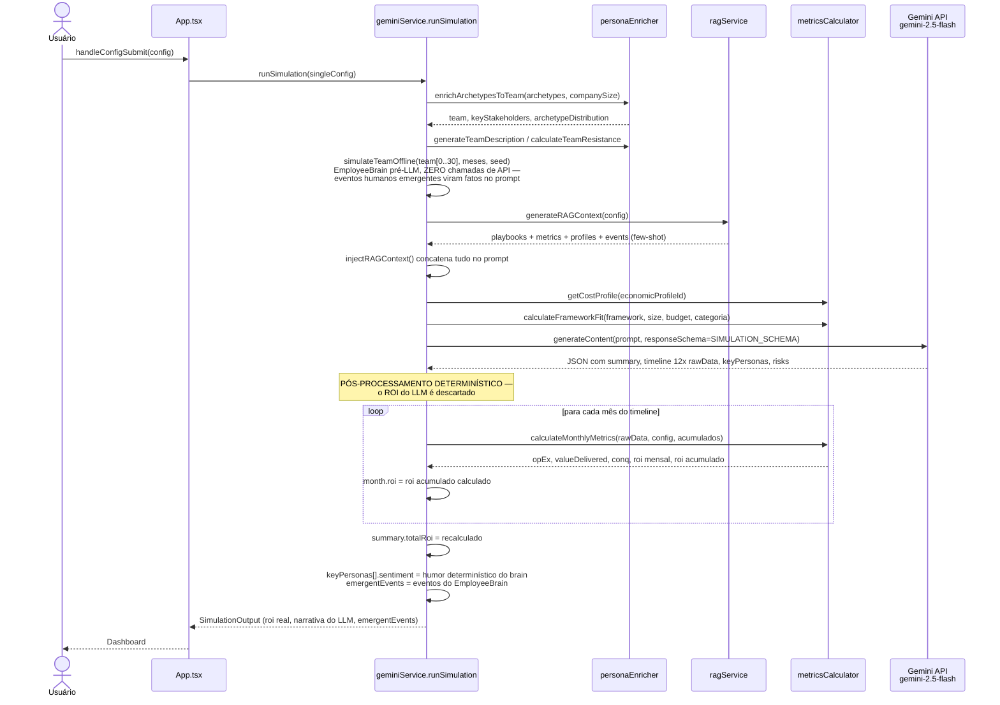
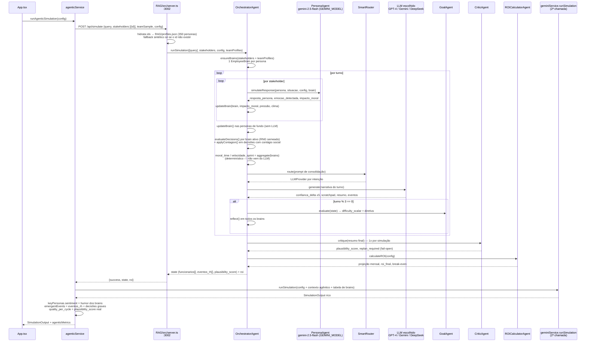
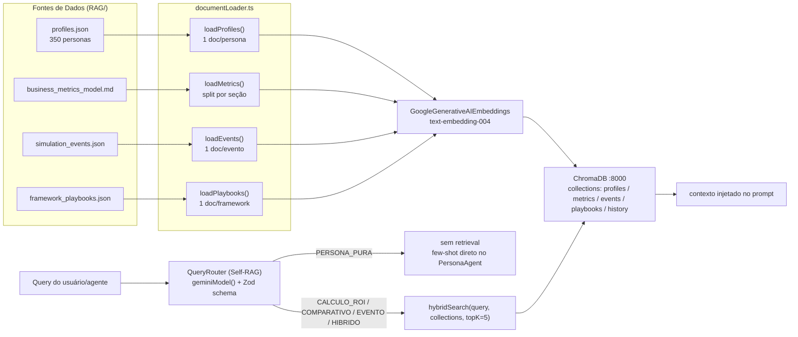
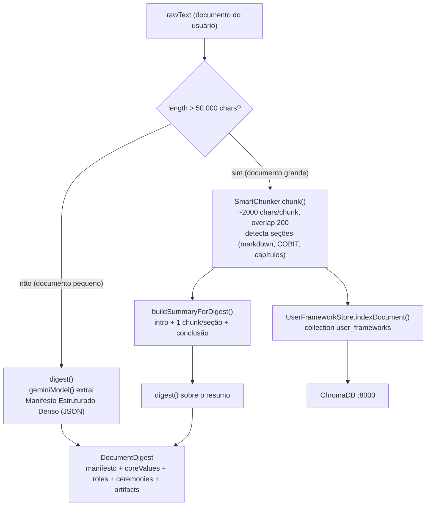
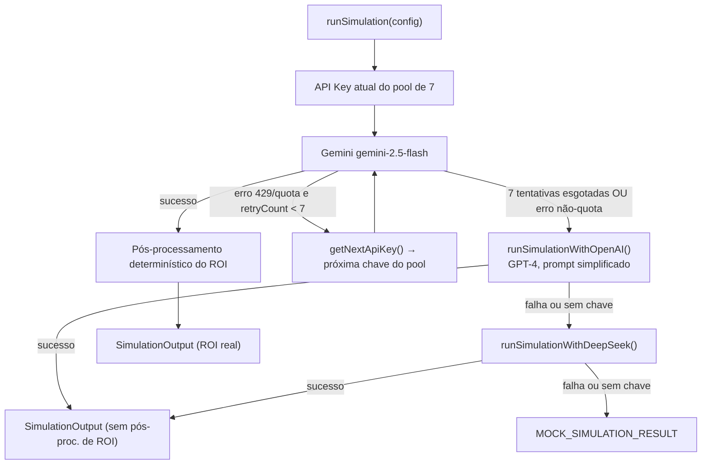
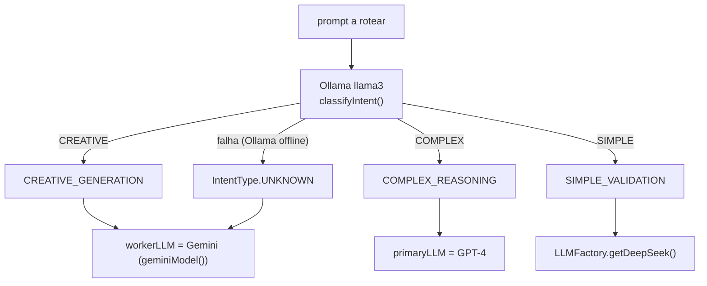
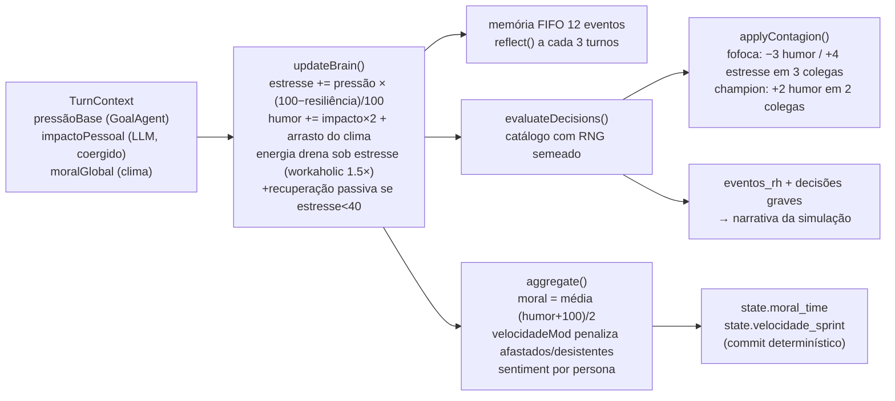

# Frame-sim — Diagramas de Arquitetura (mermaid)

> Compêndio visual do sistema. As explicações detalhadas de cada fluxo estão em [ARCHITECTURE.md](ARCHITECTURE.md); o relatório da reforma v8 está em [progress.md](progress.md). O grafo navegável do código (806 nós) está em `graphify-out/graph.html`.

## Índice

1. [Arquitetura completa (visão consolidada)](#1-arquitetura-completa)
2. [Visão geral dos dois modos](#2-visão-geral-dos-dois-modos)
3. [Fluxo Standard (browser-only)](#3-fluxo-standard)
4. [Fluxo Agentic (backend multi-turno)](#4-fluxo-agentic)
5. [Pipeline RAG (indexação e retrieval)](#5-pipeline-rag)
6. [Ingestão de documentos do usuário](#6-ingestão-de-documentos)
7. [Cascata de fallback Multi-LLM (frontend)](#7-cascata-de-fallback-multi-llm)
8. [SmartRouter (roteamento por intenção)](#8-smartrouter)
9. [EmployeeBrain — ciclo de vida do funcionário](#9-employeebrain--ciclo-de-vida)

---

## 1. Arquitetura completa

Todos os módulos e como se conectam — frontend, backend agêntico, EmployeeBrain, dados e serviços externos.

**Invariante central:** o LLM nunca decide números. ROI vem de `metricsCalculator.ts` / `roiCalculator.ts`; moral/velocidade vêm de `aggregate()` dos brains; `keyPersonas.sentiment` = `(humor+100)/2`.

---

## 2. Visão geral dos dois modos

Decisão standard vs agentic e o caminho de cada um ([ARCHITECTURE.md §1](ARCHITECTURE.md)).

---

## 3. Fluxo Standard

Simulação 100% no browser: enriquecimento de personas → EmployeeBrain offline → prompt → LLM → pós-processamento determinístico ([ARCHITECTURE.md §2](ARCHITECTURE.md)).

---

## 4. Fluxo Agentic

Loop multi-turno no backend com EmployeeBrain, seguido da 2ª passada standard para o output visual ([ARCHITECTURE.md §3](ARCHITECTURE.md)).

---

## 5. Pipeline RAG

Indexação dos dados estáticos e retrieval Self-RAG ([ARCHITECTURE.md §4](ARCHITECTURE.md)).

---

## 6. Ingestão de documentos

`POST /api/ingest` → DocumentAgent ([ARCHITECTURE.md §4](ARCHITECTURE.md)).

---

## 7. Cascata de fallback Multi-LLM

Resiliência do frontend a quota/erros ([ARCHITECTURE.md §5](ARCHITECTURE.md)).

---

## 8. SmartRouter

Ollama local classifica a intenção e roteia para o LLM adequado — gratuito e fail-open ([ARCHITECTURE.md §5](ARCHITECTURE.md)).

---

## 9. EmployeeBrain — ciclo de vida

Estados alcançáveis de um funcionário simulado e as decisões humanas que os movem ([ARCHITECTURE.md §7](ARCHITECTURE.md) tem o catálogo completo com gatilhos numéricos).

```mermaid
stateDiagram-v2
    [*] --> ativo

    ativo --> pediu_demissao: turnosEstresseAlto>=2 & humor<-40<br/>(sorteio 35%, RNG semeado por persona+turno) — terminal
    ativo --> licenca: estresse>90 ou energia<15<br/>(decisão tipo "burnout"; turnosAfastado=2)
    licenca --> licenca: turnosAfastado--<br/>humor recupera +10/turno rumo ao neutro
    licenca --> ativo: turnosAfastado chega a 0<br/>estresse=45, energia=60, humor+40, turnosEstresseAlto=0

    ativo --> ativo: resistencia_passiva (humor<-30 & adaptabilidade<45)<br/>confronto_lideranca (humor<-50 & influencia>70, avaliado ANTES de fofoca)<br/>fofoca (humor<-40 & influencia>60, contágio social)<br/>— no máx. 1 decisão grave destas por turno, ordem fixa
    ativo --> ativo: apoiar_mudanca / pedir_ajuda<br/>(não-graves, independentes, podem coexistir com 1 grave)
```

E a dinâmica interna a cada turno:

---

*Gerado na reforma v8 (jul/2026). Para regenerar o grafo do código: `graphify update .` → `graphify-out/graph.html`.*
