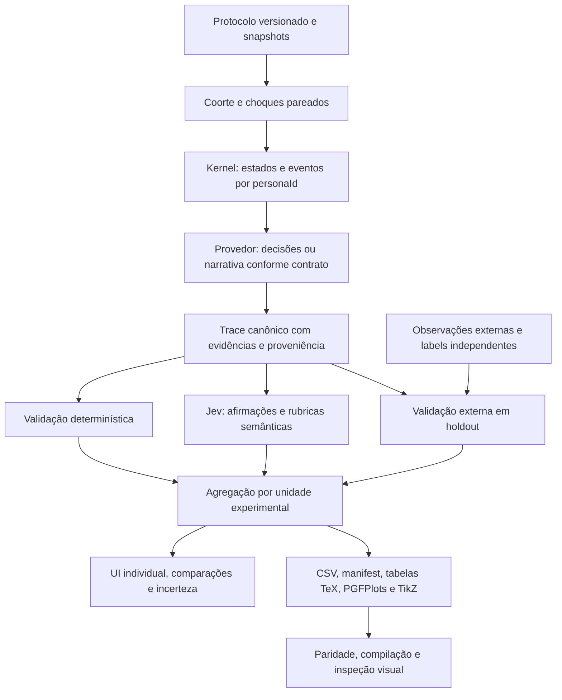

# Pesquisa: avaliações fidedignas e exportação científica do FrameSIM

Data: 4 de outubro de 2026. Código-base observado: `54e069d`; caminhos referem-se ao checkout FrameSIM. Pesquisa documental, sem leitura de credenciais e sem chamadas pagas a provedores. As fontes web abaixo foram consultadas diretamente e responderam HTTP 200 nesta pesquisa. A mesma worktree dedicada do handoff foi usada para documentação; não houve troca de branch.

## Conclusão operacional

O FrameSIM já oferece estado humano determinístico, regras de consistência, fórmulas financeiras e proveniência `live/degraded/fixture`. Isso permite avaliar **execuções da simulação**. Não permite, sozinho, demonstrar que uma persona reproduz uma pessoa observada ou que um framework produzirá certo ROI em uma organização real. Jev pode verificar afirmações contra evidências e produzir julgamentos tipados; validar seus julgamentos no domínio exige rótulos independentes. A implementação deve manter três resultados separados: consistência interna, avaliação semântica por modelo e validação empírica [S1–S6].

Uma primeira requisição bem-sucedida comprova autenticação, contrato e conectividade. Não comprova validade científica, calibração, desempenho individual ou superioridade de um framework. Sem conjunto observado, o estado da validação externa deve ser `not_available`, com motivo e campos nulos, nunca zero nem um score de plausibilidade convertido em “acurácia real”.

## Evidência das primeiras requisições do handoff

O coordenador executou as chamadas e salvou o relatório sanitizado em [`provider_probe_results.json`](provider_probe_results.json), registrado em 04/10/2026 às 15:45:47 no horário de São Paulo. Esta sub-tarefa apenas leu esse artefato, sem acessar credenciais ou executar chamadas próprias. O relatório declara `syntheticOnly: true`.

| Alvo confirmado | Resultado observado | Interpretação permitida |
|---|---|---|
| Jev global e FrameSIM, `jev-1.13.0` | HTTP 200, avaliação tipada; gateway local passthrough HTTP 200 | Contrato e caminho de chamada funcionaram para os probes sintéticos |
| Gateway Jev `0.5.0` | `globalJevConfigPreserved: true` | O relatório registra versão instalada e preservação da configuração global |
| NVIDIA `z-ai/glm-5.3` | Catálogo HTTP 200; geração HTTP 200 em 4.190 ms | Modelo exato disponível e geração retornou para a tarefa de smoke |
| NVIDIA `moonshotai/kimi-k3` | Catálogo HTTP 200; geração HTTP 200 em 11.801 ms | Modelo exato disponível e geração retornou para a tarefa de smoke |
| Gemini `gemini-flash-latest` | Alias resolveu `gemini-3.8-flash`; segunda credencial retornou geração HTTP 200 em 2.071 ms | Registrar requested model e resolved model; o alias não é pin de benchmark |
| Primeira credencial Gemini | Primeira tentativa HTTP 200 sem geração válida; retry HTTP 503 | HTTP 200 sozinho não basta para sucesso; 503 não prova chave inválida |
| NVIDIA `deepseek-ai/deepseek-v4.1-flash` | Catálogo HTTP 200; timeouts aproximadamente 30 s e 55 s | Disponibilidade de catálogo confirmada, geração ainda não validada; timeout não comprova credencial inválida nem desempenho inferior |

Esses tempos vêm de prompts e budgets diferentes, com uma ou poucas chamadas. Não comparar modelos por esses números. GLM e Kimi podem entrar como candidatos funcionais; Gemini requer retry/failover e modelo resolvido persistido; DeepSeek deve permanecer candidato pendente, com timeout/budget explícitos e rechecagem limitada. Provas iniciais não substituem avaliação em tarefas comuns, amostra, controle de ordem, erro e incerteza.

## Achados verificáveis no código

| Evidência | Consequência para a especificação |
|---|---|
| [`RAG/src/core/employeeBrainCore.ts`](../RAG/src/core/employeeBrainCore.ts) define `personaId`, humor, energia, estresse, engajamento, status, memória de 12 eventos e RNG semeado. `aggregate` produz sentimento por `personaId`. | Usar o ID estável do estado e registrar snapshots/eventos a cada turno. Estado final e memória FIFO não recompõem a trajetória completa. Esses valores são variáveis do modelo, não diagnósticos de pessoas reais. |
| [`RAG/generate_profiles.py`](../RAG/generate_profiles.py), linhas 179–296, amostra nomes, traços e histórias com `random.choice`/`random.randint` e grava perfis. README e comentários chamam os perfis de “reais”. | Há um gerador sintético explícito; não foi encontrada comprovação de coleta empírica na pesquisa. Catalogar os perfis como sintéticos ou de origem não comprovada até que sua fonte seja documentada. Não usar esses perfis como ground truth humano. |
| [`services/geminiService.ts`](../services/geminiService.ts), linhas 259–282, incorpora framework nas seeds do cérebro e finanças; [`services/batchService.ts`](../services/batchService.ts), linhas 36–43, incorpora framework na seed; racing também incorpora agente. | A mesma seed pública não garante equipe e choques iguais entre tratamentos. Separar cenário/coorte/choques da escolha de framework, provedor e persona de narração. |
| [`App.tsx`](../App.tsx), linhas 48–87, executa um resultado por framework com `Promise.all`, sem desenho de replicações pareadas. | Comparação atual é uma comparação exploratória de realizações, sem estimativa de efeito e incerteza entre tratamentos. |
| [`services/batchService.ts`](../services/batchService.ts), linhas 64–87, usa variância com divisor `n` e margem `1.96*s/sqrt(n)`; batch aceita uma execução. Falhas podem ser excluídas antes da estatística. | Com `n=1`, esse IC fica artificialmente pontual. Reportar amostra efetiva, falhas, fixtures e método. Não publicar IC inferencial com uma unidade independente. Corrigir variância amostral e a escolha do método. |
| [`services/batchService.ts`](../services/batchService.ts), linhas 131 e 230, usa `scenarioValidity` como score de warmup/racing. [`RAG/src/services/SelfImprovementService.ts`](../RAG/src/services/SelfImprovementService.ts) otimiza o score do `CriticAgent`. | A mesma função usada para selecionar parâmetros não pode fornecer a evidência final de generalização. Separar desenvolvimento, calibração e teste congelado. |
| [`RAG/src/agents/CriticAgent.ts`](../RAG/src/agents/CriticAgent.ts) combina julgamento LLM e regras; indisponibilidade retorna `degraded: true`, score 0 e `replanRequired: false`. [`RAG/src/services/MetricsService.ts`](../RAG/src/services/MetricsService.ts) define `quality_per_cycle=100-15*replans`. | Score de crítica, saúde do serviço e número de replans são medidas distintas. Persistir status `unavailable` em vez de tratar falha como desempenho baixo. Não chamar QPC de validade empírica. |
| [`services/agenticService.ts`](../services/agenticService.ts), linhas 104–202, toma estado backend, injeta no segundo `runSimulation`, associa persona pelo nome contido em `kp.role`, e reconstrói eventos graves no turno final. [`services/geminiService.ts`](../services/geminiService.ts), linhas 515–536, tem fallback de perfil por índice. | Separar renderização narrativa de fatos; não substituir ID, evento ou mês pela aproximação textual. O rich output pode representar outra trajetória. Exportar eventos canônicos com `personaId`, `turn`, `eventId` e estado anterior/posterior, preservando a origem dos dois estágios. |
| [`RAG/src/agents/orchestrator.ts`](../RAG/src/agents/orchestrator.ts), método `persistLongTermMemory`, grava resumo/critique da execução em memória longa. | Benchmark precisa snapshot ou namespace de memória/RAG congelado; caso contrário, ordem e execuções anteriores alteram contexto e podem contaminar o teste. |
| [`components/ComparisonDashboard.tsx`](../components/ComparisonDashboard.tsx), linhas 32–63, recomenda vencedor por soma de adoção, maturidade×10 e ROI positivo; radar corta ROI negativo em zero. | Pesos e normalização não têm validação empírica encontrada. Preservar negativos e apresentar trade-offs; só declarar vencedor após objetivo, margem prática e desenho comparativo explícitos. |
| [`services/batchService.ts`](../services/batchService.ts), `generateCSV`, estima uptime por incidentes e TMA pela eficiência, e usa diferença de grupos como NPS. | Nomear esses campos como proxies sintéticos. NPS requer unidade/denominador; uptime requer duração de indisponibilidade; TMA requer tempos observados. Não são medidas observacionais substituíveis pelas heurísticas atuais. |
| [`components/Dashboard.tsx`](../components/Dashboard.tsx), `downloadReport`, exporta JSON; CSV do batch não traz manifest completo, labels empíricos ou IDs individuais. | Introduzir um pacote científico nativo a partir de um dataset canônico, compartilhado por UI, CSV e LaTeX. |

Gortex não estava exposto entre as ferramentas deste pesquisador; leituras diretas e `rg` direcionado foram usados como fallback. Os achados são do código, não de execução funcional nesta sub-tarefa.

## Unidades e medidas: o que “individual” deve significar

Há dois tipos de indivíduo a medir, com contratos distintos:

1. **Persona simulada**: trajetória por ID, mudança de estado, decisões e efeitos registrados. Avaliar coerência temporal, cumprimento de restrições, alinhamento de narrativa com o estado e resultados dentro do ambiente. Não inferir produtividade pessoal de humor ou número de falas.
2. **Agente/provedor de IA**: correção do contrato, fidelidade às evidências, erros de atribuição, omissões, tokens, latência, custo, taxas de falha e cobertura da avaliação. Modelos alternativos devem receber a mesma tarefa/evidência e budget; persona e temperatura são fatores de tratamento, não diferenças ocultas.

SPACE estabelece que produtividade não pode ser medida por uma única métrica ou dimensão [S4]. DORA mede entrega de software no contexto de equipe/aplicação, não oferece validação de scores individuais de funcionários. Sua documentação atual lista cinco medidas: change lead time, deployment frequency, failed deployment recovery time, change fail rate e deployment rework rate [S5]. Usar DORA apenas quando timestamps de commit, deploy, falha e recuperação estiverem disponíveis; não deduzi-los de features/eficiência/ROI.

Proposta mínima por persona e turno:

| Dimensão | Evidência e cálculo | Limite |
|---|---|---|
| Coerência de estado | Regras de limites/transições; ID preservado; timestamps ordenados; estado anterior/posterior presente | Verifica o simulador, não a psicologia humana |
| Fidelidade narrativa | Afirmações vinculadas a event IDs, estados e trechos recuperados; proporção apoiada/contradita/sem suporte | Jev é avaliador semântico a calibrar |
| Decisões e consequências | Decisões emitidas e efeitos atribuídos pelo kernel, com normalização por oportunidades elegíveis | Não atribuir efeito coletivo inteiro a cada persona |
| Bem-estar simulado | Trajetória de estresse, energia, humor e afastamento | Indicadores sintéticos, sem diagnóstico clínico |
| Resultado de tarefa | Objetivo, regra de sucesso e oportunidade registrados antes da execução; contabilizar falhas/ausências | Exige tarefa observável; não existe hoje por persona de modo geral |
| Correspondência externa | Predição congelada e resultado humano/organizacional posterior independente | Indisponível sem dados externos e protocolo |

Não lançar um score global obrigatório. Se houver score composto para exploração, exportar componentes, pesos, unidades, versão e análise de sensibilidade; a UI deve permitir compreender o resultado sem confundi-lo com acurácia.

## Jev: decomposição e calibração

O contrato vivo de TypeSafe é `POST https://api.typesafe.ai/v1/systemone`, com `state`, `model` e `questions`. Choice retorna uma opção e distribuição; Score é expectativa sobre níveis descritivos ordenados; Noul retorna probabilidade de “sim” sem confidence separado [S1–S3]. O gateway deve preservar esse significado, além do modelo realmente resolvido e uso de tokens. `jev-latest` é útil para descoberta; um benchmark deve registrar/pinar a versão concreta retornada.

Aplicação recomendada:

- Calcular fórmulas, limites, hashes, atribuição de ID e presença de citação em código. Jev não deve recalcular ROI nem ser autoridade sobre uma restrição matemática.
- Enviar `state={personaId, turn, before, after, events, claims, sourceSpans}` e uma pergunta atômica por dimensão/afirmação. Questões independentes sobre o mesmo estado podem viajar juntas.
- Para relação claim-evidência, Choice com `supports`, `contradicts`, `insufficient_evidence`. Para propriedade binária com evidência suficiente, Noul. Para grau qualitativo, Score com níveis observáveis, não adjetivos genéricos de “ruim” a “bom”.
- Validar previamente que a evidência está presente. Evidência ausente gera `unavailable/insufficient_evidence`, não probabilidade inventada de 0,5. `0.5` em Noul é equilíbrio sim/não, não “qualidade média”.
- Usar o padrão oficial de citation checking: procurar citação literal em código; pedir relação semântica apenas para fontes encontradas [S3]. O threshold 0,8 do cookbook é exemplo, não limiar universal para FrameSIM.
- Tratar a confidence de Choice/Score como concentração da distribuição, não probabilidade de a execução inteira estar correta [S2]. Não chamá-la de IC 95%.

Protocolo de avaliação do avaliador:

1. Criar exemplos revisados por humanos, com cenário, afirmação, fonte, classe e justificativa. Incluir atribuição errada de persona, mês errado, ROI correto com narrativa falsa, contraexemplo e ausência de evidência. Casos mutados pelo código validam robustez interna; não contam como amostra de pessoas reais.
2. Dividir por cenário/coorte/organização e tempo entre desenvolvimento, calibração e teste, bloqueando duplicatas e variantes do mesmo caso entre splits. Os rótulos de teste permanecem fora do prompt e do RAG. Revisores não veem a identidade do provedor candidato quando isso não for necessário à tarefa.
3. Registrar concordância humana e adjudicar divergências. Preferência de um único juiz não é ground truth de desempenho real. O estudo primário sobre LLM-as-judge documenta vieses de posição, verbosidade e auto-favorecimento [S6]. Em comparações semânticas, randomizar ordem A/B e testar reversão; usar avaliador separado do gerador reduz conflito, mas não elimina viés.
4. Para Noul/binary, medir Brier `mean((p-y)^2)`, log loss com clipping declarado, reliability diagram com contagem por bin, precisão/recall e cobertura/risco por threshold. Para Choice, confusion matrix, log loss multiclasses e desempenho por classe; para Score, erro ordinal e concordância contra rubrica humana. Estimar incerteza agrupando exemplos correlacionados.
5. Brier e log loss medem resolução e incerteza além de calibração; um Brier menor não demonstra, sozinho, melhor calibração [S7]. Exibir curva de confiabilidade e suportes por bin. ECE, se incluído, precisa método de binning e tamanho da amostra; não usar isoladamente.
6. Ajustar threshold ou calibrador somente no split de calibração. Medir versão calibrada e bruta no teste congelado. Não usar as mesmas amostras para ajustar e declarar sucesso; a documentação de calibração exige dados disjuntos [S7].
7. Registrar rubrica, modelo, perguntas, prompt, código, dataset e calibrador em versões/hashes. Sem labels suficientes, relatar medição piloto e abstinência; não prometer calibração “real”.

Plano inicial de amostragem: preparar **100 unidades independentes por fase** de desenvolvimento, calibração e teste, como meta de piloto, não como garantia universal de poder ou calibração. Os três conjuntos não compartilham cenário/coorte/organização nem variantes do mesmo caso. Expansões, perguntas e mutações de uma única trajetória continuam sendo um único cluster, mesmo que produzam centenas de linhas. Se não houver 100 unidades observadas por fase, reportar o número real e a condição pendente; não completar a quota gerando seres humanos fictícios.

Fixtures internas podem conter ao menos 100 casos de contrato/coerência por fase com casos adversariais e sementes declaradas, mas precisam ser identificadas `synthetic` e não contar como evidência empírica. Mesmo a expressão “100 casos” exige distinguir contagem de linhas e de clusters independentes. Para a comparação de simulações, dimensionar número de pares por precisão/efeito do piloto; 100 seeds não é equivalente a 100 organizações reais.

## Comparações pareadas reproduzíveis

Registrar um `EvaluationProtocol` antes de executar: objetivo primário, unidade experimental, tratamentos, baseline, seeds/coortes, budget, duração, rubrica, memória/RAG congelados, exclusões e margem de efeito considerada útil.

- Gerar uma lista pública de seeds de **cenário** que não inclua nome do framework, modelo ou agente. Criar a mesma equipe inicial e os mesmos choques exógenos para A e B.
- Usar streams separados e endereçados por `(scenarioSeed, personaId, turn, mechanismId)`. Se A e B consomem quantidades diferentes de draws, compartilhar só um PRNG sequencial perde o pareamento. Eventos causados pelo tratamento não precisam ser idênticos; a igualdade vale para condições/choques exógenos.
- Mesmo kernel, versões de regras, custos, duração, retrieval snapshot e objetivo. Rodar também baseline sem intervenção e ablações: kernel, kernel+narrativa, RAG e roteamento. Para comparar provedores, fixar estado e tarefa; a comparação deve declarar se mede qualidade da narrativa ou impacto de decisões no loop.
- Calcular `delta_i = outcome_B_i - outcome_A_i` por par. Reportar média/mediana, IC, distribuição, fração acima da margem prática e pares completos/incompletos. Se houver várias métricas, declarar objetivo primário e ajustar inferência confirmatória ou rotular os demais como exploração.
- Usar IC t sobre deltas quando hipóteses forem defensáveis, ou bootstrap pareado/clusters. O contrato SciPy `paired=True` reamostra os mesmos índices para ambos os grupos; BCa pode ser degenerado e precisa tratamento explícito [S8]. Não instalar Python no runtime web por isso: a fonte fundamenta o algoritmo, não impõe dependência.
- Meses, personas e falas dentro de um run são correlacionados e não devem aumentar artificialmente `n`. A unidade independente pode ser cenário/seed; para dados empíricos, organização/coorte. Reamostrar essa unidade e declarar qual população é inferida.
- Com `n<2`, devolver IC indisponível. Com poucos pares ou degenerate data, reportar a limitação e não declarar vencedor. Não existe número universal de seeds que garanta poder estatístico; determinar replicações por piloto, variância e margem prática.
- Trials live preservam variabilidade do serviço: seed local não fixa texto/latência do LLM. Replay do trace avalia determinismo do kernel; novas chamadas avaliam repetibilidade operacional. São testes diferentes.
- Contabilizar todos os trials planejados. Separar `live`, `degraded`, `fixture`, timeout, erro do avaliador e evidência insuficiente. Estimativas entre pares completos devem vir acompanhadas da taxa e padrões de perda; nunca esconder falha de tratamento como se fosse vitória do outro.

## O que falta para validação empírica

O estudo primário de agentes individuais ancorados em self-reports valida predições contra respostas humanas retidas e contra a própria consistência test-retest; isso é substancialmente diferente de rotular um personagem sintético como real [S9]. O artigo de validação de modelos baseados em agentes define validação como correspondência ao processo que gerou dados observados e explicita desafios de calibração, micro/macro e sensibilidade [S10].

Para FrameSIM, preparar um adaptador de dataset observado, com proveniência e permissões de uso documentadas, contendo:

```text
datasetId, datasetVersion, provenance, unitId, organizationId/cohortId,
observationTime, horizon, inputsKnownAtPredictionTime,
targetDefinition, targetValue, unit, sourceRef, labelAuthor,
labelProtocolVersion, split, missingReason
```

Dados possíveis: resultados de tarefas com critérios de aceitação, surveys repetidos de adoção/satisfação, logs agregados de entrega/incidentes e custos observados. Identificadores de pessoas podem ser pseudônimos. Separar observação e inferência em cada campo. Não usar evento inventado pelo mesmo modelo para validar esse modelo.

Comparar predições a baselines simples: prevalência histórica para evento binário, último valor para série temporal, regra financeira/empírica documentada para custos. Para contínuos, MAE/RMSE, viés e cobertura/largura do intervalo preditivo; para evento, Brier/log loss, discriminação e reliability. Um intervalo de médias de runs sintéticos não representa intervalo preditivo de uma organização real. Avaliar estratos e mudança de domínio; a validade limita-se à população, horizonte e target efetivamente estudados.

Ausência de dados reais **não bloqueia** implementação de telemetria, rubricas, pareamento, exportação e testes internos. Bloqueia apenas a conclusão de validação externa. Entrega técnica concluída e validação empírica pendente são estados simultâneos e honestos.

## Exportação nativa para artigo LaTeX

Gerar arquivos editáveis a partir do mesmo dataset canônico usado no dashboard, preservando precisão integral; arredondar somente na apresentação. A exportação científica é uma funcionalidade do aplicativo, não um prompt para que o LLM escreva números ou uma imagem de screenshot.

Pacote sugerido:

```text
framesim-paper/<evaluationId>/
  report.tex                 # artigo standalone de exemplo, UTF-8
  tables/summary.tex          # booktabs/siunitx, inserível por \input
  tables/persona-evals.tex
  figures/timeline.tex       # PGFPlots, inserível por \input
  figures/paired-deltas.tex
  figures/reliability.tex
  figures/flowchart.tex      # TikZ, editável
  data/runs.csv
  data/persona-turns.csv
  data/paired-deltas.csv
  data/reliability.csv
  data/manifest.json         # versões, seeds, unidades, hashes, métodos, status
  references.bib
  README.md                  # compiler e dependências, significado de cada IC
```

PGFPlots permite coordenadas de erro explícitas e assimétricas e leitura tabular [S11]. Exportar `value`, `ci_lower`, `ci_upper` e as diferenças `error_minus=value-ci_lower`, `error_plus=ci_upper-value`; não exigir simetria do bootstrap. Escolher rótulo “IC da média sintética” ou “intervalo preditivo” conforme o protocolo. Nunca usar confidence de Jev como barra de erro frequentista.

Requisitos de qualidade:

- Escape de TeX em texto externo (`%`, `_`, `&`, `#`, `$`, `{`, `}`, `~`, `^`, `\`), CSV com quoting correto e filenames/paths controlados. Não aceitar instruções TeX arbitrárias oriundas de modelo/upload; tratar como dados.
- Exportar ausentes como valores ausentes documentados; evitar `NaN`, `Infinity`, divisão por zero e zero inventado. Preservar ROI negativo, unidades/moeda e denominadores.
- Todos os modos — individual, comparação, batch e racing — usam o mesmo serializer, critérios e proveniência. Exportar erros, amostras efetivas e versão do protocolo, não só resultados bem-sucedidos.
- Incluir figures em PDF/SVG vetoriais como complemento, quando o runtime suportar; `.tex`/PGFPlots deve funcionar sem rasterização. Documento exemplo standalone e snippets inseríveis são dois contratos diferentes.
- Testar paridade numérica UI/CSV/TeX, dados adversariais e importação do pacote. Compilar o exemplo e os snippets em harness de teste, sem shell-escape, e inspecionar layout. Compilação bem-sucedida verifica a exportação, não a validade das conclusões.

Fluxo recomendado, reutilizável como Mermaid no app e TikZ no pacote:



Quando observações não existem, a etapa externa retorna status indisponível e o fluxo segue para resultados internos identificados. O fluxograma de implementação deve explicitar onde a saída do provedor efetivamente muda o kernel: no modo de narração, deve apenas verbalizar o trace; no modo de decisão, a ação passa por validação e aplicação determinística antes do próximo estado.

## Gates executáveis propostos

1. Toda avaliação individual referencia uma persona e eventos canônicos, sem join por nome ou índice.
2. Fixtures/degradação/erro do juiz nunca entram silenciosamente no agregado live ou viram ground truth.
3. A/B compartilham coorte/choques exógenos; um replay do mesmo tratamento/trace reproduz estados e métricas.
4. IC informa método, unidade independente, `n_planned`, `n_completed`, `n_paired` e perda; `n=1` produz indisponível.
5. Teste de Juiz com labels independentes mede discriminação, calibração e abstinência; sem labels retorna status pendente.
6. Warmup não consulta labels/teste congelado; memória não cruza splits/trials sem protocolo explícito.
7. Todos os modos exportam TeX editável e dados usados; paridade numérica e compilação são verificadas.
8. Só comparar modelos explicitamente identificados e disponíveis; medição de latência, tokens e custo vem de chamadas reais ou é rotulada indisponível/estimada. Custos fixos atuais não são tabela universal para novos modelos NVIDIA/Google.

## Fontes primárias consultadas

- **[S1] TypeSafe, API reference e primitivas**: [API](https://docs.typesafe.ai/api.md), [Noul](https://docs.typesafe.ai/primitives/noul.md), [Score](https://docs.typesafe.ai/primitives/score.md), [índice vivo](https://docs.typesafe.ai/llms.txt). Contratos de estado, questões e respostas; endpoint v1.
- **[S2] TypeSafe, Confidence**: <https://docs.typesafe.ai/confidence.md>. Distinção entre probabilidade e concentração da distribuição; confidence de Choice/Score.
- **[S3] TypeSafe, Double-checking citations**: <https://docs.typesafe.ai/cookbooks/citation_check.md>. Verificação literal em código, relação semântica e revisão de casos incertos; threshold do exemplo não é resultado FrameSIM.
- **[S4] Forsgren et al., The SPACE of Developer Productivity**: [página dos autores/Microsoft Research](https://www.microsoft.com/en-us/research/publication/the-space-of-developer-productivity-theres-more-to-it-than-you-think/), ACM Queue 19(1), 2021. Produtividade multidimensional.
- **[S5] DORA, software delivery performance metrics**: <https://dora.dev/guides/dora-metrics-four-keys/>. A URL histórica contém “four-keys”, mas a página consultada descreve cinco métricas atuais e escopo por aplicação/equipe.
- **[S6] Zheng et al., Judging LLM-as-a-Judge with MT-Bench and Chatbot Arena**: <https://arxiv.org/abs/2306.05685v4>, 2023, NeurIPS Datasets and Benchmarks. Viés de posição, verbosidade e self-enhancement; concordância estudada no benchmark dos autores não transfere automaticamente a FrameSIM.
- **[S7] scikit-learn, Probability calibration**: <https://scikit-learn.org/stable/modules/calibration.html>. Definição de reliability diagram, limitações do Brier isolado e separação de dados de ajuste/calibração.
- **[S8] SciPy, `stats.bootstrap`**: <https://docs.scipy.org/doc/scipy/reference/generated/scipy.stats.bootstrap.html>. Pareamento por índices, tipos de IC e degeneração.
- **[S9] Park et al., LLM Agents Grounded in Self-Reports Enable General-Purpose Simulation of Individuals**: <https://arxiv.org/abs/2411.10109v3>, versão de 28/06/2026 consultada. 1.052 participantes, respostas retidas e referência test-retest; não é validação do FrameSIM.
- **[S10] Windrum, Fagiolo e Moneta, Empirical Validation of Agent-Based Models: Alternatives and Prospects**: <https://jasss.org/10/2/8.html>, JASSS 10(2), 2007. Validação empírica, calibração e problemas metodológicos de modelos baseados em agentes.
- **[S11] PGFPlots Manual, Error Bars**: <https://tikz.dev/pgfplots/reference-errorbars>, documentação 1.18.2. Input tabular e erros explícitos assimétricos. A página atribui o manual aos autores do pacote; [código oficial](https://github.com/pgf-tikz/pgfplots).

Decisões de projeto e gates são recomendações desta pesquisa, não afirmações de que essas funcionalidades já existem nem resultados obtidos com dados reais.
