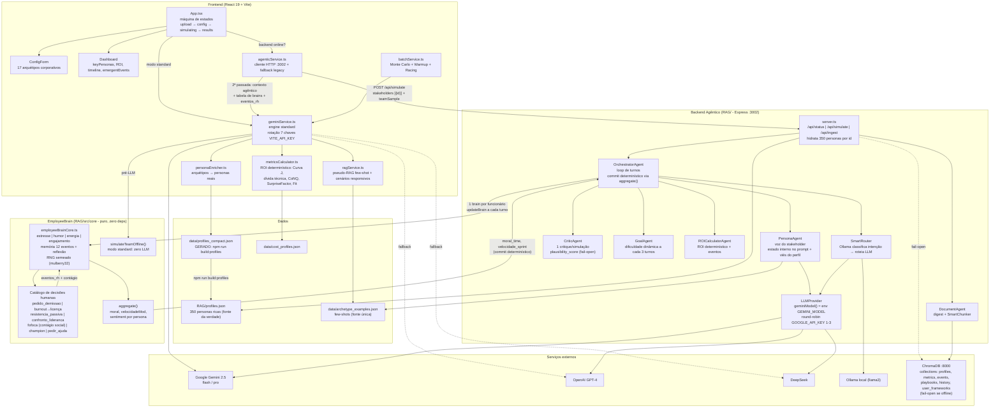
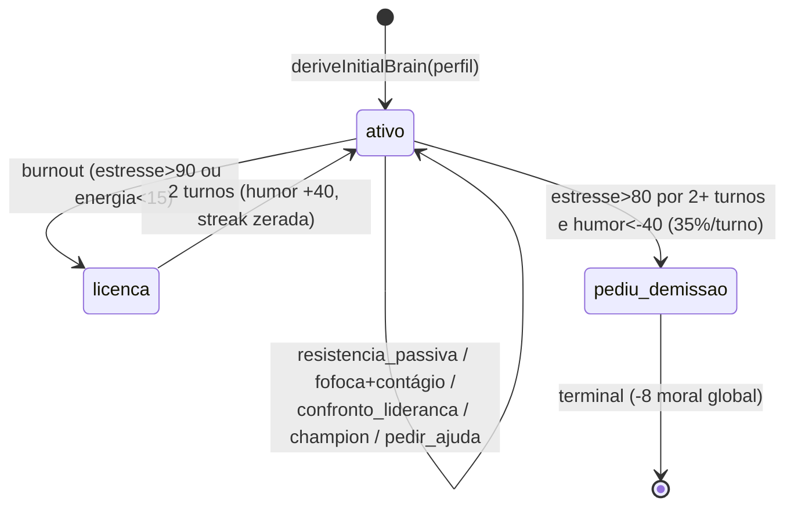

# Progress — Grande Reforma Frame-sim v8 (julho/2026)

> Relatório completo da sessão de evolução do Frame-sim: contexto para agentes de IA (graphify + dotcontext), arquitetura documentada em mermaid, personas reais ligadas de ponta a ponta, e o **EmployeeBrain** — um cérebro determinístico individual por funcionário simulado, com nível de estresse, dinamismo humano e decisões realistas de ambiente de trabalho.

---

## 1. Resumo executivo

O projeto estava parado desde janeiro/2026. Nesta sessão foram entregues **14 commits** em 4 fases, transformando a simulação de "personas como texto de prompt" para **funcionários simulados com estado interno individual que evolui turno a turno e toma decisões humanas** (pedir demissão, entrar em burnout, fazer resistência passiva, espalhar insatisfação, virar champion da mudança) — tudo determinístico, reprodutível por seed e com **zero chamadas extras de LLM**.

Princípio arquitetural consolidado: **o LLM narra, a matemática decide**. Nenhum número financeiro ou de estado de equipe vem mais do LLM.

| Métrica | Antes | Depois |
|---|---|---|
| Personas ricas usadas pelo backend | 0 (sintéticas fabricadas) | 350 (RAG/profiles.json hidratadas) |
| Personas no banco compacto do frontend | 100 (viés cognitivo vazio) | 350 (viés derivado deterministicamente) |
| Estado emocional por funcionário | inexistente (só média global) | estresse/humor/energia/engajamento/memória/decisões por pessoa |
| Fonte da moral/velocidade da simulação | deltas inventados pelo LLM (fallback `moral -= 5`) | `aggregate()` determinístico dos brains |
| `keyPersonas.sentiment` no output | inventado pelo LLM | derivado do humor simulado: `(humor+100)/2` |
| CriticAgent no loop principal | nunca rodava (só no Racing) | 1 critique/simulação; score real vira `quality_per_cycle` |
| Modelos Gemini do backend | gemini-1.5-* (**404 — aposentados**) | `GEMINI_MODEL` env, default gemini-2.5-flash |
| Vector store no servidor | nunca conectado (RAG no-op) | conectado fail-open (3s timeout) |
| Diagramas versionáveis | 0 (só PNGs externos) | ARCHITECTURE.md com 8+ mermaid |
| Contexto para agentes de IA | inexistente | `.context/` (dotcontext) + `graphify-out/` (grafo 806 nós) |
| Testes executáveis | 0 | 6 (brain.test.ts) + smokes de servidor |

---

## 2. Arquitetura completa (mermaid)



### Ciclo de vida de um funcionário simulado



---

## 3. O que foi feito, fase a fase

### Fase 0 — Base limpa (commits `5ba02b3`, `8bbee99`, `fac9ff4`)
- O diff pendente desde janeiro foi separado em 3 commits coesos: fix de lazy-init dos singletons do RAG (env lida antes do dotenv), recalibração do modelo determinístico (Curva J suave, cenários responsivos, surprise ~15%, FrameworkFit no prompt) e docs WIP.
- Corrigido import quebrado do SmartChunker em `UserFrameworkStore.ts` (typecheck estava vermelho).

### Fase 1 — Contexto e documentação (commit `e0fa84f`)
- **graphify**: grafo de conhecimento do código gerado em `graphify-out/` (`graphify update .`) — hoje com **806 nós, 1276 arestas, 45 comunidades**; navegável em `graphify-out/graph.html`.
- **dotcontext**: MCP registrado (`npx @dotcontext/mcp install`) e pasta `.context/` criada com `docs/index.md`, `architecture.md`, `conventions.md` e 5 módulos (`frontend`, `services`, `rag-backend`, `data`, `simulation-model`) — contexto denso para qualquer agente de IA que abrir o repo. `runtime/` no `.gitignore`.
- **`ARCHITECTURE.md`**: 10 seções, 8+ diagramas mermaid (visão geral, sequências standard/agentic, pipeline RAG, multi-LLM, modelo matemático, EmployeeBrain, mapa de arquivos, env vars, grafo).
- **`README.md`** reescrito: v7.1→v8, estrutura real de pastas (o antigo mostrava um `src/` inexistente), quickstart dos dois modos, tabela de env vars, changelog condensado.

### Fase 2 — Personas reais + EmployeeBrain (commits `82ebb4a`, `66ddb9f`, `a415d23`, `b380dcf`)
- **2.1 Unificação de personas**: `scripts/build_profiles_compact.mjs` gera `data/profiles_compact.json` a partir das **350** personas de `RAG/profiles.json` (antes: 100 desincronizadas). `vies_cognitivo` agora é derivado deterministicamente de `psicologia_comportamento` (antes: vazio → viés aleatório). Byte-idempotente; `npm run build:profiles`.
- **2.2 Backend com personas reais**: `/api/simulate` aceita `[{id}]` (hidrata perfil completo das 350), `string[]` legado (retrocompat) e `teamSample` (até 30 ids de fundo). Vector store conectado no startup em fail-open (timeout 3s — Chroma offline não derruba nada). Smoke: `Personas hidratadas: 2 reais, 1 sintéticas — Avery Souza, Julia Brown, ...`.
- **2.3 EmployeeBrain core** (`RAG/src/core/employeeBrainCore.ts`, ~430 linhas, **zero imports** — compartilhado entre backend e frontend):
  - Estado por funcionário: `estresse` 0-100, `humor` −100..+100, `energia`, `engajamento`, `status`, memória FIFO de 12 eventos com valência, reflexão periódica, traços derivados do perfil real (`resiliencia` de `gestao_estresse`, `adaptabilidade` de `abordagem_trabalho`/`opiniao_agil`, `influencia` de cargo/senioridade).
  - Dinâmica por turno: pressão efetiva = pressão × (100−resiliência)/100; humor arrastado pelo clima global; energia drena sob estresse (workaholics 1.5×) e recupera passivamente quando estresse < 40.
  - **Catálogo de decisões humanas** com gatilhos e probabilidade semeada: pedido de demissão, burnout→licença (com recuperação real de humor no retorno), resistência passiva, confronto com liderança, fofoca com **contágio social** (afeta 3 colegas), champion da mudança, pedir ajuda.
  - 100% reprodutível: RNG `mulberry32(hash(personaId:turno))`.
  - **6 testes** (`RAG/src/tests/brain.test.ts`, `npx tsx src/tests/brain.test.ts`): perfil frágil estressa antes do resiliente; demissão dispara determinística; mesmo seed = mesmo resultado; clamps invioláveis; contágio exato; calibração-alvo (equipe resiliente 0 baixas/12 meses; frágil 2-4 baixas/6 meses sob pressão alta).
- **2.4 Integração nos dois caminhos**:
  - *Agentic*: o orchestrator cria 1 brain por stakeholder + time de fundo; o `impacto_moral` que o PersonaAgent já retornava (e era descartado) agora alimenta o humor individual; decisões e contágio rodam por turno; **moral e velocidade da simulação passam a vir de `aggregate()`** — o LLM só narra (scratchpad/resumo/eventos) e ajusta confiança em ±5; o antigo fallback "parse falhou → moral −5" desapareceu. O PersonaAgent recebe o estado interno no prompt ("aja de acordo, não revele números") e usa o viés do perfil. `state.funcionarios` e `state.eventos_rh` saem no response.
  - *Standard (browser-only)*: `simulateTeamOffline()` roda **antes** do LLM (zero chamadas), os eventos humanos previstos entram no prompt como fatos ("Mês 4: Maria pediu demissão..."), e depois do parse o `keyPersonas.sentiment` é sobrescrito pelo humor determinístico; `SimulationOutput.emergentEvents` novo (opcional — UI não quebra).
  - Smoke integrado: response com 7 brains de nomes reais, estados diferenciados por pessoa, moral 56.3 e velocidade 86.9 derivadas do aggregate.

### Fase 3 — Refinos (commits `6ec191f`, `2e67cf0`, `e6e13db`, `64a4b02`)
- **Modelos aposentados**: `gemini-1.5-pro/flash` retornavam **404** (aposentados pela API) — o modo agêntico estava 100% quebrado. Todos os call sites (6 no backend + 2 no frontend) migrados para `geminiModel()` (env `GEMINI_MODEL`, default `gemini-2.5-flash`, leitura lazy pós-dotenv). Racing pool: 2.5-flash/2.5-pro.
- **CriticAgent no loop principal**: 1 critique por simulação (custo mínimo), fail-open; `plausibility_score` real viaja no state e substitui o `quality_per_cycle: 100` hardcoded do frontend; score < 70 anexa a crítica ao scratchpad.
- **Few-shots deduplicados**: `data/archetype_examples.json` é a fonte única (antes: duplicados divergentes em `ragService.ts` e `personaAgent.ts`).
- **`.env.example`** completos (raiz + RAG) enumerando toda env var realmente lida pelo código — chaves são rotacionadas, nunca commitadas.

### Revisão Opus + correções (commit `803b0fa`)
Um agente Opus revisou todo o trabalho da Fase 2 (bugs + realismo). Achados confirmados e corrigidos:
- **C1 (crítico)**: `impacto_moral` ausente/não-numérico no JSON do LLM virava `NaN` e envenenava a moral global para sempre → coerção na função compartilhada `updateBrain` (cobre os dois caminhos).
- **I1**: a licença de burnout devolvia a pessoa com humor −70 e streak de estresse intacta → pedia demissão no mesmo turno. Agora recupera humor (+10/turno afastado, +40 no retorno) e zera a streak.
- **I3**: `confronto_lideranca` era branch morto (subconjunto estrito de `fofoca` avaliado depois) → reordenado.
- **I2**: guard contra nome vazio no match de sentiment (`includes('')` casava tudo com o primeiro brain).
- **M2**: recuperação passiva de energia (evita burnout por drenagem em horizontes > 18 meses).
- Recalibração verificada após as correções: `OK 6 tests`, alvos preservados.

### Fechamento (commits `cbbe823` + este)
- Toda a documentação atualizada para o estado final (ARCHITECTURE.md, README, code.md, `.context/`).
- Grafo regenerado: 684→**806 nós** (o EmployeeBrain e a integração entraram no mapa).

---

## 4. Decisões de design (e porquês)

1. **Determinístico + LLM só dá voz** — segue o padrão já consagrado no projeto (ROI nunca vem do LLM) e custa **zero chamadas extras**: o PersonaAgent já fazia 1 call/persona/turno; o brain só enriquece esse prompt. Importante porque as chaves são free-tier rotacionadas.
2. **Padrões do Google ADK em TypeScript** (sem runtime Python): sessão com estado (`state.funcionarios`), hierarquia de agentes (brains sob o Orchestrator), loop de avaliação (CriticAgent). Padrão *Generative Agents* (Stanford) reduzido: memory stream compacto + reflexão determinística + decisões.
3. **Módulo core puro (zero imports)** — o mesmo arquivo é importado pelo backend (tsx/NodeNext) e pelo frontend (Vite), validado em build e runtime. Sem cópia duplicada para manter em sincronia.
4. **Retrocompatibilidade total** — `/api/simulate` aceita o formato antigo; campos novos são opcionais; frontend sem backend continua caindo no modo standard; Chroma/Critic/Ollama são todos fail-open.
5. **Reprodutibilidade** — tudo semeado. Mesmo cenário + mesmo seed = mesma simulação (essencial para Monte Carlo e para depurar).

## 5. Como verificar

```bash
# Testes do brain (6 asserts)
cd RAG && npx tsx src/tests/brain.test.ts     # → OK 6 tests

# Typecheck
npx tsc --noEmit          # raiz (frontend + core compartilhado)
cd RAG && npx tsc --noEmit

# Regenerar personas compact (idempotente)
npm run build:profiles

# Servidor agêntico + smoke
cd RAG && npm run server
# → "✅ Personas reais carregadas: 350" e "🧠 Brains inicializados: N" no /api/simulate

# Grafo do código
graphify update .          # → graphify-out/graph.html
```

## 6. Próximos passos sugeridos (não incluídos)

- Exibir `emergentEvents` e o painel de estresse individual no Dashboard (o dado já chega no output).
- `BATCH_PERSONAS`: 1 chamada LLM com todas as personas do turno (2 calls/turno em vez de N+1) — economiza quota em times grandes.
- Reflexão via LLM em batch (a determinística é rasa de propósito — `ponytail:` marcado no código).
- Unificar as semânticas offline vs agentic (moral inicial 50 vs 70 — achado M1 da revisão, cosmético).
- Roadmap comercial do `roadmap.md` (auth, PostgreSQL, Stripe) segue válido.

---

*Sessão de 07-08/jul/2026 — 15 commits, ~1.400 linhas de código/testes novas, 6 subagentes Sonnet + 1 revisor Opus orquestrados. Documentação viva em `ARCHITECTURE.md`, `.context/` e `graphify-out/`.*
